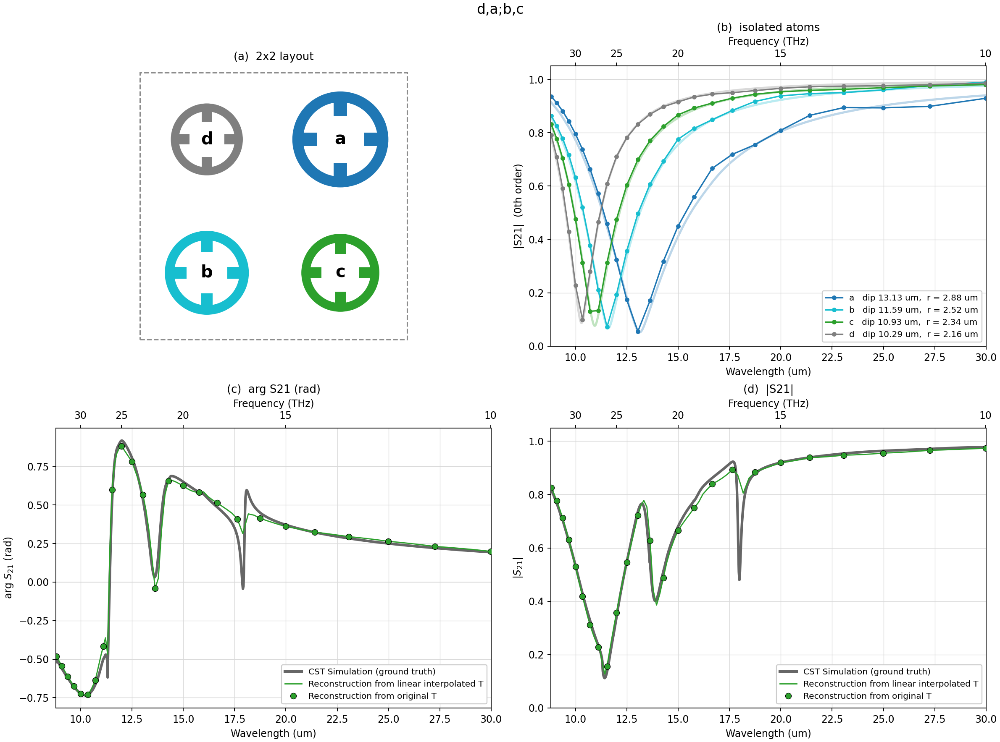

# Transition-Matrix Extraction and Macroscopic Metasurface Scattering

A multi-scale simulation pipeline for metasurfaces: extract the **transition
matrix (T-matrix)** of a single unit cell from one full-wave CST simulation,
then predict the S-parameters of arbitrarily large arrays with fast linear
algebra — no full-wave simulation of the array required.

The repeated cell may hold **one** meta-atom or **several different** ones, so a
metasurface can be composed out of measured atoms rather than simulated as a
whole.

Validated end-to-end on the `dary` branch against direct CST periodic
simulations and the independent [treams](https://github.com/tfp-photonics/treams)
code: `test/single` (pitch 2 µm, 8–20 µm) to **|ΔS| ≤ 0.003** and **~3×10⁻⁴**
respectively, seven single-atom `test/2x2` lattices (pitch 8 µm, 10–34 THz, a
resonant band) and ten *mixed* supercells built from those measured atoms —
**eighteen direct CST benchmarks** in all.  Fourteen of the eighteen agree to
**mean |ΔS| 0.016–0.080**, limited by the input T-matrix rather than by the
aggregation, which reproduces an independent implementation to **10⁻¹²**. The
best four-distinct-atom cell, `e,a;f,c`, reaches **mean |ΔS| 0.023 — inside the
range of its own constituent atoms measured alone**, so composing them costs no
accuracy beyond measuring them.

The four that do not agree are documented failures. Three share a diagnosed
cause — a pair of atoms whose circumscribing spheres nearly touch, where the
spherical addition theorem converges too slowly to truncate. The fourth,
`e,b;c,a`, is a deliberate counterexample showing that this cause is
**necessary but not sufficient**: it has a wider tightest gap than the cell it
is 5× worse than. Its matched control `e,b;g,a` — *identical* worst pair, ρ and
gap, but 10 % mirror mismatch instead of 25 % — recovers a factor of 3.4, which
makes arrangement symmetry a measured second axis rather than a conjecture. See
[`experiment.md`](experiment.md) and
[`results_2x2_EBCA_l3/REPORT.md`](aggregation/results_2x2_EBCA_l3/REPORT.md).

<p align="center">

<br><em>test/single</em>
</p>
<p align="center">

<br><em>test/2x2: reconstruction (blue), treams (orange), direct CST (grey)</em>
</p>

### → [`experiment.md`](experiment.md): composing metasurfaces from measured meta-atoms

Spoke-and-wheel resonators of different size, whose isolated T-matrices were
extracted separately, are combined in one repeated 16 µm cell — three two-species
checkerboards (`a,b;b,a`, `a,c;c,a`, `b,c;c,b`), all three distinct arrangements
of A, B, C, D at once (`a,b;c,d`, `a,d;b,c`, `a,c;d,b`), and `e,b;c,a`, built
from a wider atom pool to be looser than the best of those and less symmetric
than the worst. The pipeline predicts each mixed metasurface's S-parameters; a
direct CST simulation of that metasurface then checks the prediction. Read
[`experiment.md`](experiment.md) for the whole story — it is the shortest route
into what this repository does and how far it can be trusted.

<p align="center">

<br><em>Seventeen of the eighteen benchmarks (c,a;g,f is in the summary table
but not this figure). Markers are the T-matrix prediction, pale lines
the direct CST run of the same structure. Bottom right: accuracy against the
translation convergence ratio rho. The seven single atoms rise monotonically
with it over two decades; the four-species cells do not — e,b;c,a has the
lowest rho of the four original ones and is 5x worse than a,d;b,c. rho bounds
the error at fixed composition and does not order cells against one another.</em>
</p>

### The best case: four distinct atoms predicted to the accuracy of their own inputs

<p align="center">

<br><em>`e,a;f,c` — the best-conditioned four-distinct-atom cell in the study
(rho 0.652, mirror mismatch 7.7 %). <b>MSE of the complex 0th-order S21 against
direct CST = 0.0011</b>, mean |ΔS21| = 0.023. (a) the cell to scale; (b) each of
its four atoms alone on its own 8 µm lattice, markers predicted and pale CST;
(c), (d) the cell itself. Atoms are relabelled a–d by rising resonance
frequency <b>within this figure only</b> — elsewhere a letter is a fixed row of
the parametric sweep. Editable EPS alongside the PNG.</em>
</p>

This is the cleanest statement of what the method can do. The cell's mean error,
**0.023**, sits *inside the range of its own four constituent atoms measured
alone* — 0.016, 0.017, 0.023 and 0.030 (panel b). **Composing four separately
measured meta-atoms into a new metasurface costs no accuracy beyond what was
paid to measure them.** All three resonances land: 0.127 @ 11.43 µm against
0.112 @ 11.42 measured, 0.386 @ 13.95 against 0.401 @ 13.89, and 0.805 @ 18.18
against 0.480 @ 17.98. The last one is the residual — a narrow collective notch
the truncated coupling under-reaches, and essentially the whole of the MSE.

Its sibling [`e,c;f,a`](aggregation/results_2x2_ECFA_l3/cell_ecfa.png) is the
**same four atoms rearranged** and scores 0.0028. `Σ_s T_s` is identical for the
two, so the 0.066 mean difference CST measures between them is arrangement
alone, and the method reproduces it.

```bash
python -m tmatrix.aggregation.plot_cell_detail EAFC ECFA --format eps
```

### How the refined frequency grid is built

The `.tmat.h5` files store 25 frequencies over 10–34 THz, 1 THz apart. A lattice
resonance is far narrower than that, so the stored grid *aliases* it, while an
isolated atom's own T is broad (Q ≈ 5–10) and genuinely smooth over 1 THz.
`run_supercell.py --refine N` exploits exactly that asymmetry
([`refine_grid`](src/tmatrix/aggregation/run_supercell.py)):

```python
freq = np.unique(np.concatenate(
    [np.linspace(f0[i], f0[i + 1], refine + 1) for i in range(len(f0) - 1)]))
j = np.clip(np.searchsorted(f0, freq) - 1, 0, len(f0) - 2)
w = ((freq - f0[j]) / (f0[j + 1] - f0[j]))[:, None, None]
T_new = (1 - w) * T[j] + w * T[j + 1]
```

Each stored interval is subdivided N ways and duplicate endpoints merged, so 25
points become 97 at `--refine 4`. **Only the input T is interpolated** — linearly
in the complex matrix, between its two bracketing stored samples, which is why
the curve is labelled *complex interpolation*. Everything downstream is then
recomputed exactly at every new frequency: the Ewald lattice sums W_st(k∥), the
block solve (I − W T₀) a = a_inc, and the Floquet projection. **The sharp
structure the refined curve shows is solved for, not drawn in.**

It converges, and it matters:

| refine | points | MSE vs CST | dips of \|S21\| (µm, depth) |
|---|---|---|---|
| 1 | 25 | 0.0011 | 11.43 (0.156), 14.24 (0.488), 18.39 (0.884) |
| 4 | 97 | 0.0020 | 11.43 (0.127), 13.95 (0.386), 18.18 (0.805) |
| 8 | 193 | 0.0018 | 11.39 (0.126), 13.93 (0.386), 18.06 (0.766) |
| CST | 1005 | — | 11.42 (0.112), 13.89 (0.401), 17.98 (0.480) |

4 → 8 moves the dips by ≤ 0.12 µm, so `--refine 4` is converged for these cells.
Note the MSE *rises* from 0.0011 to 0.0020: the stored grid was flattering the
prediction by sampling both curves at the same aliased points. 0.0020 is the
honest number. For `e,b;c,a` the effect is larger — its deepest predicted
feature reads 0.399 @ 16.66 µm on the stored grid and 0.145 @ 16.27 µm refined.

**One caveat.** Each `tmat.h5` is merged from two CST band extractions, and
interpolating T across the join mixes two independent runs. The refined line is
not meaningful inside the seam: **20–21 THz (14.28–14.99 µm)** for every atom
except **A**, whose seam is **18–19 THz (15.78–16.66 µm)**. The stored points
themselves are unaffected.

Highlights: a mixed cell is **not** an interpolation of its constituents — each
species red-shifts onto the sparser 11.31 µm sublattice, and `a,c;c,a` grows a
hybrid resonance neither pure lattice has. Every two-species cell supports a
**dark lattice resonance** at the supercell's own Rayleigh condition that no
single-atom model can show, confirmed full-wave. Four *distinct* species break
that symmetry: the dark diffraction orders switch on 7.8 THz lower, the cell
becomes birefringent by an amount that tracks which pair sits on the diagonal,
and **rearranging the same four atoms changes |S21| by up to 0.43** — `Σ_s T_s`
is identical for all three arrangements and cannot tell them apart. Arrangement
also decides whether the prediction is usable: a purpose-built third cell holds
the pair geometry fixed while changing the symmetry class, and the error does
not move — so within one atom set the accuracy follows the geometry. A fifth
four-atom cell then shows that this does not generalise across atom sets: at the
*lowest* convergence ratio of all four it is 5× worse than the best of them, so
neither the ratio nor the symmetry orders the cells on its own. The write-up
also takes the residual error apart into the mechanisms that produce it,
reproducibly
(`tmatrix.aggregation.error_budget`), and documents the three cases where the method
breaks and why ([`OPEN_QUESTIONS.md`](OPEN_QUESTIONS.md) carries what is still
unresolved).

---

## Pipeline overview

| Stage | What it does | Code | Status |
|---|---|---|---|
| **1. Near-field extraction** | Illuminates the *isolated* unit cell with a set of plane waves in CST (frequency-domain solver, open boundaries) and exports complex E/H on a spherical monitor | `tmatrix.extraction.extract_cst_near_fields` | main |
| **2. T-matrix projection** | Projects the recorded fields onto vector spherical wave functions (VSWFs) and solves F = T·A in least squares → `*.tmat.h5` | `tmatrix.extraction.compute_t_matrix_projection` | main |
| **3. Array aggregation → S-parameters** | Couples the per-cell T-matrices through the Foldy–Lax multiple-scattering equations (finite arrays or infinite lattices) and projects the collective response onto plane waves → S11/S21 | `tmatrix.aggregation` | **this branch** |
| **3b. Heterogeneous supercell** | A repeated cell holding *several different* meta-atoms: pair-resolved Bloch coupling `W_st`, a block Foldy–Lax solve, and the full Floquet S-matrix over every open diffraction order | `tmatrix.aggregation.supercell` + `run_supercell` | **this branch** |

Theory reference: `ref/main.tex` (operational manual). The physics in one
breath: the scattering of one cell is the linear map `f = T a` between
incoming (regular) and outgoing VSWF coefficients; an array couples cells via
translation operators `A(d)`, giving the self-consistent system
`a^i = a_inc^i + Σ_j A(R_j−R_i) T a^j`; the summed outgoing far fields of a
subwavelength lattice collapse into the 0th diffraction order, giving
`S21 = 1 + (2πi/kA)·ê*·F(+ẑ)` and `S11 = (2πi/kA)·ê*·F(−ẑ)`.

## Repository layout

Code lives under `src/tmatrix/` and is installed as one package; data stays at
the top level, where the CST campaign manifest records its absolute paths.
`tmatrix.paths` is the only module that knows those locations — nothing
resolves a data directory from its own `__file__`.

### Code

```
pyproject.toml                installable package; `pip install -e .`
src/tmatrix/
  units.py                    c in both conventions, lambda <-> f
  numerics.py                 maxabs, rel_err/rel_frob, richardson, nearest_idx
  plotting.py                 Agg setup, THz twin axis, parabolic minima, dips
  results_io.py               readers for periodic/treams/CST run outputs
  paths.py                    where the data directories are
  cst_env.py                  where the CST python libraries are ($CST_PYTHON_LIB)
  treams_compat.py            the Windows/numpy-2 gufunc cast patch, once

  extraction/                 stages 1-2: CST near fields -> VSWF -> tmat.h5

  aggregation/                stage 3 (this branch)
    vswf.py                   VSWF engine: fields, plane waves, far field, projections
    translate.py              translation operators + lattice sums (Richardson-extrapolated)
    aggregate.py              Foldy-Lax finite-array + periodic solves
    sparams.py                S11/S21, energy balance, cross sections
    mirror.py                 PEC ground plane via exact image theory
    tmat_io.py                tmat.h5 reader
    run_demo.py               full 49-frequency demo (periodic + finite arrays)
    run_mirror_demo.py        ground-plane variant
    treams_reference.py       independent cross-check via treams
    cst_direct/               direct CST periodic reference simulation

    --- generic drivers: any tmat.h5 + pitch, no code edits ---
    run_case.py               periodic sweep + convergence/finite-array checks,
                              with adaptive multipole truncation (--lmax auto)
    treams_case.py            treams cross-check for the same case
    cst_packed_reference.py   direct reference straight out of a packed *.cst
                              (no CST install needed; --list picks the run)
    plot_case.py              figures + agreement metrics for a results dir

    --- stage 3b: several different atoms in one repeated cell ---
    supercell.py              pair-resolved Bloch sums W_st, block solve,
                              full Floquet channels, finite-cluster T^O
    ewald_supercell.py        the same W_st by Ewald summation (the method the
                              heterogeneous case needs -- see below)
    run_supercell.py          driver: any list of tmat.h5 + positions + lattice
    treams_supercell.py       independent end-to-end treams reference
    error_budget.py           where the residual disagreement with CST comes
                              from, frequency by frequency
    compare_cases.py          all fourteen benchmarked cases in one table
    arrangement_predictors.py rho and mirror mismatch per arrangement
    jones_xy.py               both polarizations -> the cells' Jones diagonal
    plot_supercell.py         per-case figures + agreement metrics
    plot_comparison.py        the whole study in one figure
    plot_figure_slide.py      presentation figure with drawn cell layouts
    plot_experiment_summary.py  atoms vs mixed cells vs diffracted power
    cst_supercell/            direct CST benchmarks; --pair takes 2 or 4 atoms

tests/aggregation/            VSWF and translation layers, the manual's 6.5.5
tests/test_suites.py          the pytest front end that runs them all
```

### Data

```
ref/                          theory manual (LaTeX + PDF)
test/single/                  demo unit cell: spoke-and-wheel gold resonator
  saw_gold_wl15p0025um.tmat.h5   49 freqs (8-20 um), lmax 3, tmat.h5 format
test/2x2/                     second case: same shape, four sizes, 8 um pitch
  saw_gold_wl10p30um_10to34THz.tmat.h5   atom E, scale 3.00 (packed run 1)
  saw_gold_wl10p90um_10to34THz.tmat.h5   atom C, scale 3.25 (run 10)
  saw_gold_wl11p60um_10to34THz.tmat.h5   atom F, scale 3.50 (run 8)
  saw_gold_wl13p10um_10to34THz.tmat.h5   atom A, scale 4.00 (run 6)
  saw_gold_wl14p90um_10to34THz.tmat.h5   atom G, scale 4.50 (run 7)
  saw_gold_wl17p30um_10to34THz.tmat.h5   atom B, scale 5.00 (run 2)
  saw_gold_wl23p50um_10to34THz.tmat.h5   atom D, scale 5.50 (run 3)
                              each 25 freqs (10-34 THz), lmax 5.  The `wl` is
                              the atom's own transmission dip on its own 8 um
                              lattice, so the file names identify the sweep row
  SAW_gold_noSub_packed.cst   packed CST project: 10-run parametric sweep
                              over `scale`, holding the periodic run that is
                              the direct reference for each atom

aggregation/                  stage 3 outputs
  results/                    the test/single demo: figures, CSV/NPZ spectra
  results_2x2/                the test/2x2 case (REPORT.md, CSV/NPZ, figures)
  results_{A..G}_ewald_l3/    the seven single-atom lattices
  results_2x2_super_l3/       a,b;b,a  (also the method REPORT for all cells)
  results_2x2_{AC,BC}_l3/     a,c;c,a and b,c;c,b
  results_2x2_{ABCD,ADBC,ACDB}_l3/
                              the three distinct arrangements of A, B, C, D
  results_2x2_EBCA_l3/        e,b;c,a -- lowest rho of the four, most
                              asymmetric, and 5x worse than a,d;b,c
  *_fine/                     the same sweeps on a 4x refined frequency grid
  cst_direct/, cst_supercell/ the CST projects and their solver logs
  REPORT.md                   results and findings
  IMPLEMENTATION_GUIDE.md     full tutorial: how this was built from scratch
```


## Conventions (read this before touching anything)

All Stage-3 code follows the [tmat.h5 standard](https://doi.org/10.48550/arXiv.2404.10399)
exactly as declared by the data file:

* time dependence **e^(−iωt)**, outgoing radial functions **h_l^(1)**
* orthonormal spherical harmonics with **Condon–Shortley** phase
* Jackson-normalized VSWFs: `X = LY/√(l(l+1))`, `M = z_l X`, `N = (1/k)∇×M`
  — note N's radial term carries a factor **i** in this convention
* parity basis (TE/"magnetic" = M-waves, TM/"electric" = N-waves)
* `f = T a` (the file calls `f` "p"); mode order read from `/modes`, never assumed
* lmax = 3 → n = 2·lmax·(lmax+2) = 30 modes

## Quickstart

Requirements: Python ≥ 3.10 with `numpy`, `scipy ≥ 1.15` (`sph_harm_y`),
`h5py`, `matplotlib`; optionally `treams` for the cross-check. CST is **not**
needed to run Stage 3.

Install the package once, in editable mode — the data directories are located
relative to the checkout, so a non-editable copy install will not find them:

```bash
pip install -e .
```

Then, from anywhere:

```bash
pytest -m "not slow"      # validation suite, ~2 min
python -m tmatrix.aggregation.run_demo      # ~8 min: 49 freqs, lattice + finite arrays
python -m tmatrix.aggregation.plot_results  # figures + CSV into aggregation/results/
```

`pytest` alone runs everything including the search-heavy gates (~25 min); a
suite whose input data is not in the checkout is skipped rather than failed.
Set `TMATRIX_ROOT` if you need to point the code at a different checkout's
data, and `CST_PYTHON_LIB` / `AUTO_CST_DIR` if CST lives somewhere other than
this machine's default.

Minimal API example — periodic array at normal incidence:

```python
from tmatrix.aggregation.tmat_io import TMatrixData
from tmatrix.aggregation.vswf import plane_wave_coeffs
from tmatrix.aggregation.translate import lattice_sum_C, make_quad
from tmatrix.aggregation.aggregate import solve_periodic
from tmatrix.aggregation.sparams import sparams_normal, energy_balance
from tmatrix.paths import DEMO_TMAT

data = TMatrixData(DEMO_TMAT)
i = 21                                   # frequency index (~15 um)
k = data.k_at(i)                         # rad/um
C = lattice_sum_C(k, 2.0, data.modes, 0.8, make_quad())   # pitch 2 um
a_inc = plane_wave_coeffs([0, 0, 1], [1, 0, 0], data.modes)
a, f = solve_periodic(data.T[i], C, a_inc)
S = sparams_normal(k, 4.0, data.modes, f)                 # A_cell = 4 um^2
R, T, Aabs = energy_balance(S)
```

Finite arrays with arbitrary in-plane positions and per-site T-matrices:
`aggregate.build_finite_system` + `solve_finite`, then `sparams_normal` with
`A = N·A_cell`.

### Running a new case

`run_case` does the whole sweep for any `tmat.h5` plus a pitch, no code edits.
Relative `--out` paths resolve against `aggregation/`, so the results land
beside the others regardless of your working directory. The `test/2x2` case,
end to end (~2 min for the sweep):

```bash
python -m tmatrix.aggregation.run_case test/2x2/saw_gold_wl13p10um_10to34THz.tmat.h5 --pitch 8.0 --r0 3.0 --lmax auto --finite 2 3 5 9 --out results_2x2
```

```bash
python -m tmatrix.aggregation.treams_case test/2x2/saw_gold_wl13p10um_10to34THz.tmat.h5 --pitch 8.0 --out results_2x2/treams_reference.npz --lmax auto
```

```bash
python -m tmatrix.aggregation.cst_packed_reference test/2x2/SAW_gold_noSub_packed.cst --list
```

```bash
python -m tmatrix.aggregation.cst_packed_reference test/2x2/SAW_gold_noSub_packed.cst --run 6 --out results_2x2/cst_direct_reference.csv
```

```bash
python -m tmatrix.aggregation.plot_case results_2x2
```

Two things that bite on a new case:

* **`--lmax auto`.** Translation operators grow like
  `h_l⁽¹⁾(k·pitch) ~ (2l−1)!!/(k·pitch)^(l+1)`, so on a deep-subwavelength
  lattice the high-l block of the lattice sum is enormous and amplifies
  whatever extraction noise sits in the high-l rows of `T`. For `test/2x2`
  (lmax 5, pitch 8 µm) `cond(I − C·T)` reaches 5×10⁵ at 11 THz and the answer
  comes out with negative absorption. `--lmax auto` keeps, per frequency, the
  largest truncation with `cond ≤ --cond-max` (100 by default) — lmax 3/4/5
  across that band — which restores A ≥ 0 without touching the well-conditioned
  part of the spectrum. See `results_2x2/REPORT.md`.
* **Parametric sweeps in a packed `.cst`.** Signals are versioned by the 3D Run
  ID; the newest is rarely the one you want. `--list` prints the run table
  (parameter values per run) so you can pick. `cst_packed_reference.py` reads
  the archive directly — it is a ZIP variant with `DE` signatures and 32-bit
  time/date fields, holding a SQLite result store — so no CST install is
  needed.

## Validation summary

### `test/single` — spoke-and-wheel, pitch 2 µm, lmax 3

| check | result |
|---|---|
| Mie sphere: optical theorem = ∫\|F\|² = Mie series | 3×10⁻¹⁵ |
| plane-wave reconstruction from VSWF expansion (E and H) | 3×10⁻⁸ |
| translation operator re-expansion / r₀-invariance | 2×10⁻⁷ / 3×10⁻⁷ |
| lattice-sum stability (taper set, quadrature, r₀) | ≤ 2×10⁻⁶ |
| input-file conventions: passivity max SV(I+2T) / reciprocity | 1.00007 / matches file's own metric |
| reciprocity of array S-params (S21 = S12) | 2×10⁻⁴ |
| finite arrays (5×5 → 13×13) → infinite-lattice limit | monotone ✓ |
| lossless array over PEC mirror: R = 1 (unitarity) | exact (1.000000) |
| **treams** (independent Ewald code), complex S, 49 freqs | ≤ 3.4×10⁻⁴ |
| **direct CST periodic simulation**, 8–20 µm | \|ΔS21\| ≤ 0.0011, \|ΔS11\| ≤ 0.0029 |

### `test/2x2` — same shape ×4, pitch 8 µm, lmax 5, 25 freqs

Run with `--lmax auto`; full write-up in
[`aggregation/results_2x2/REPORT.md`](aggregation/results_2x2/REPORT.md).

| check | result |
|---|---|
| r₀ (×0.8) and quadrature (20×40 → 28×56) invariance | ≤ 1.3×10⁻¹⁰ |
| lattice-sum taper length (kRc/1.4) | ≤ 4.3×10⁻³ |
| energy balance A = 1 − R − T | ≥ 0.010 (all 25 freqs) |
| **treams**, complex S | max 0.070, mean 0.019 |
| **direct CST periodic simulation** (run 6 of the sweep), complex S | max 0.078 / 0.077, mean 0.022 / 0.031 (S21 / S11) |
| resonance position vs direct CST | 13.097 µm vs 13.126 µm (0.2 %) |

The looser agreement is the input file's, not the aggregation's: this
T-matrix violates passivity by 2.8 % and reciprocity by up to 11 % (vs 0.007 %
and 0.6–1.2 % for `test/single`), and the largest error sits exactly at the
seam between its two merged extraction bands.

### Heterogeneous supercells — seven atoms, seven mixed cells, fourteen CST benchmarks

Method and full validation ladder in
[`aggregation/results_2x2_super_l3/REPORT.md`](aggregation/results_2x2_super_l3/REPORT.md);
per-cell results in the sibling `results_2x2_*_l3/REPORT.md`. Atoms A
(`scale` 4.00), B (5.00), C (3.25), D (5.50), E (3.00), F (3.50) and G (4.50)
combined in a 16 µm repeated cell at 8 µm atom pitch, 10–34 THz.
`python -m tmatrix.aggregation.compare_cases --all` prints every case in one
table.

**The aggregation itself is exact.** Every algebraic identity the manual's
§6.5.5 ladder asks for holds to round-off, and an independent treams
implementation of the whole chain — its own cluster T-matrix, Ewald lattice
interaction and plane-wave projection — agrees on complex S and on the power
sums over all open orders:

| check | result |
|---|---|
| M = 1 reduces to the one-atom code (coupling, `f`, S11/S21) | bit-identical |
| 2×2 cell of four identical atoms ≡ the primitive lattice | ≤ 8×10⁻¹⁶ |
| basis-atom relabelling / whole-cell lattice shift | ≤ 7×10⁻¹⁶ / 0 |
| checkerboard selection rule: power in the odd (n1+n2) orders | ≤ 6×10⁻³³ |
| all T = 0 → S = S_bg exactly (manual §8 row 7) | 0 |
| finite-cluster T^O vs the multi-center far field, L_C = 14 | 1.9×10⁻⁹ |
| **independent treams implementation, every cell** | **≤ 1×10⁻¹²** |

**Against direct CST**, the MSE of the complex 0th-order S21 —
mean(\|S21_pred − S21_CST\|²) over the stored frequencies, on the complex
amplitude so a phase error counts — for each of the fourteen benchmarks, ordered
by the addition theorem's convergence ratio ρ = (aᵢ + aⱼ)/d over the 8 µm
neighbour pairs:

| case | ρ | MSE | mean \|ΔS21\| | | case | ρ | MSE | mean \|ΔS21\| |
|---|---|---|---|---|---|---|---|---|
| E alone | 0.539 | 0.00028 | 0.016 | | G alone | 0.809 | 0.00094 | 0.028 |
| C alone | 0.584 | 0.00038 | 0.017 | | a,b;b,a | 0.809 | 0.00367 | 0.046 |
| F alone | 0.629 | 0.00066 | 0.023 | | **e,b;g,a** | **0.809** | **0.0182** | 0.078 |
| **e,a;f,c** | **0.652** | **0.0011** | **0.023** | | **e,b;c,a** | **0.809** | **0.0612** | 0.181 |
| a,c;c,a | 0.652 | 0.00067 | 0.019 | | a,d;b,c | 0.854 | 0.0118 | 0.080 |
| **e,c;f,a** | **0.674** | **0.0028** | **0.040** | | B alone | 0.899 | 0.0039 | 0.054 |
| **c,a;g,f** | **0.719** | **0.0015** | **0.031** | | a,c;d,b | 0.944 | **0.1206** | 0.244 |
| A alone | 0.719 | 0.00107 | 0.030 | | a,b;c,d | 0.944 | **0.1654** | 0.308 |
| b,c;c,b | 0.742 | 0.00171 | 0.036 | | a,b;c,d | 0.944 | **0.1654** | 0.308 |
| | | | | | D alone | 0.989 | **0.0351** | 0.149 |

MSE is the metric the figures are scored by; it separates the four-atom cells by
**14×** (0.1654 against 0.0118) where the mean absolute error separates them by
only 3.8×, because the `a,b;c,d` disagreement is concentrated in a few badly
misplaced resonances rather than spread across the band.

**Within one atom set ρ is the cause, not a correlate.** `a,c;d,b` was built to
test exactly that: it reproduces `a,b;c,d`'s worst pair, ρ and 0.448 µm gap
while putting a different pair on the diagonal, so it separates pair geometry
from arrangement symmetry, which are confounded in the other two cells. It lands
with `a,b;c,d`. The two cells at ρ = 0.944 are within 1.4× of each other; the one
at ρ = 0.854 is 10–14× better than either. See
[`results_2x2_ACDB_l3/REPORT.md`](aggregation/results_2x2_ACDB_l3/REPORT.md).

**Across atom sets it is not sufficient, and that is measured.** `e,b;c,a` was
built from the wider pool to have the *lowest* ρ of the four four-atom cells
(0.809 against 0.854) while being the *most* mirror-asymmetric of them. It is
5.2× worse than the cell at ρ = 0.854, and it fails qualitatively: it puts the
depth on the wrong one of the cell's two collective modes (0.145 at 16.3 µm and
0.431 at 19.7 µm, against CST's 0.444 and **0.097**). Note the four rows at
ρ = 0.809 in the table above: MSE 0.00094 for a single atom, 0.00367 for a
two-species checkerboard, 0.0182 and 0.0612 for two four-atom cells — the same
convergence ratio, 65× apart. See
[`results_2x2_EBCA_l3/REPORT.md`](aggregation/results_2x2_EBCA_l3/REPORT.md).

**Arrangement symmetry is the second axis, and that is a controlled result.**
`e,b;g,a` reproduces `e,b;c,a`'s pair geometry *exactly* — same worst pair A–B,
same ρ = 0.8092, same 1.5265 µm gap — and is *tighter* on all three remaining
8 µm pairs, so every distance-based metric ranks it same-or-worse. Its mirror
mismatch is 10.0 % against 25.0 %. It scores **0.0182, 3.4× better**, and it
places its deep mode to 0.46 µm where `e,b;c,a` misses by 3.46 µm.

**The same control on the ρ axis comes out backwards, and that bounds where the
predictors work.** `c,a;g,f` holds the mismatch at 7.1 % — identical to
`e,c;f,a` — and *raises* ρ from 0.674 to 0.719. It scores 0.0015 against
0.0028, **1.9× better**, so it is the one pair in 23 where the cell that is
better-or-equal on both predictors has the *higher* error. Neither predictor
orders the eight four-atom cells alone; together they hold in 22 of 23
decidable pairs, and the exception sits at the bottom of the range. The four
cells below 0.003 span only 0.0011–0.0028 while their constituent atoms alone
score 0.00028–0.00107 — within a small factor of their own input floor, where
the ranking is set by whichever narrow collective mode each cell hosts rather
than by pair geometry. **Read the predictors as a filter that rejects bad
cells, not as a ranking among good ones.**

Fourteen of the eighteen land at 0.016–0.080, limited by the input T-matrices rather
than by the aggregation. Three of the four that fail are documented with the
cause diagnosed in [`experiment.md`](experiment.md): they contain a pair of
atoms whose circumscribing spheres nearly touch. Eq. (57) is *satisfied* there —
the addition theorem simply converges too slowly to truncate, since its error
falls like ρ^lmax and ρ = 0.99 buys 1 % per multipole order. Raising lmax makes
it worse, and treams reproduces the wrong answer to 10⁻¹⁵, which is the sharpest
demonstration in the study that cross-code agreement validates the
implementation and only full-wave validates the physics. The fourth, `e,b;c,a`,
has no such pair and fails anyway — so a ρ threshold is a floor to refuse below,
not a certificate to accept above.

Three things the heterogeneous case forced:

* **The tapered lattice sum does not survive a sub-lattice shift.** The
  displacement-tapered blocks still satisfy `Σ_t W_st = C_p` to 10⁻¹⁵ — the
  taper error is common to all blocks and cancels in the sum, which is why the
  one-atom lattice was always accurate — but each *individual* block is only
  ~4×10⁻² converged at the default `kRc = (10, 14, 20)`, and a heterogeneous
  cell weights the blocks by different `T`s. `ewald_supercell.py` supplies them
  by Ewald summation instead (manual §6.5.3 sanctions exactly this), which is
  also 30× faster and reproduces the published one-atom `test/2x2` numbers
  exactly.
* **Diffraction is no longer optional.** A 16 µm cell has Rayleigh onsets at
  16 µm and 11.31 µm inside a band reaching 8.82 µm, so `run_supercell.py`
  reports every propagating Floquet order, not a scalar S11/S21.
* **The one-atom `--lmax auto` rule must not be reused.** `cond(I − W T₀)` for a
  supercell also contains the folded k∥ ≠ 0 bands, which are legitimately
  near-singular next to a Rayleigh anomaly, so capping it discards physics. The
  supercells run at fixed lmax 3.

## Key physical findings for the demo cell

* The free-standing 2 µm-pitch array is featureless in-band
  (|S21| 0.99→0.94): the *isolated* resonator has no resonance in 8–20 µm.
  The designed λc = 15 µm response is a **ground-plane (MIM) resonance** —
  Stage 1 removes the ground plane by design, so this is correct physics,
  confirmed by three independent computations.
* Adding a PEC ground plane by image theory (`mirror.py`) restores an
  absorption resonance near the design band at the design spacing
  (`results/fig6_mirror_absorber.png`) — qualitative, since the real
  dielectric spacer is not part of the extracted T-matrix.
* Practical CST warning (cost us two wrong runs): with `"unit cell"`
  boundaries CST sizes the period to the **geometry bounding box** unless
  `UnitCellFitToBoundingBox "False"` + `UnitCellDs1/Ds2` are set — an
  island-type cell silently becomes a *touching*, near-totally-reflective
  mesh. See `aggregation/cst_direct/` and REPORT.md §4b.

## Known limitations (Stage 3, current state)

* Normal incidence only (Bloch phases and the 1/cosθ port factor are
  documented extension points, not wired in).
* Square lattices for the periodic path; finite arrays take arbitrary
  in-plane positions.
* Multipole truncation is a real constraint, not a formality: on a
  deep-subwavelength lattice the Foldy–Lax system conditions like
  `(k·pitch)^(-(2lmax+2))`, so beyond some lmax the extra modes add noise
  rather than physics. `run_case.py --lmax auto` picks the budget per
  frequency; `run_demo.py` keeps the file's lmax = 3, which is safe there.
  Do **not** transplant `--lmax auto` to a supercell — see the section above.
* **Closely spaced atoms are the hard limit.** The outgoing→regular translation
  is a two-centre multipole expansion whose truncation error falls like ρ^lmax
  with ρ = (aᵢ + aⱼ)/d. Above ρ ≈ 0.85 accuracy degrades; above ρ ≈ 0.94 it
  breaks, and no truncation repairs it because the physics living in the gap
  cannot be written as multipoles about two separated centres. Manual §6.6
  names the fixes (plane-wave-mediated coupling, or a composite T-matrix
  enclosing the pair); neither is implemented. **The pipeline does not currently
  warn about this** — see [`OPEN_QUESTIONS.md`](OPEN_QUESTIONS.md) §3.
* **A low ρ is not a guarantee.** The converse of the point above is *not*
  established, and one cell measures it directly: `e,b;c,a` at ρ = 0.809 is 5×
  worse than `a,d;b,c` at 0.854. So ρ is a condition to refuse below, not a
  certificate to accept above; a cell that clears the threshold still needs a
  full-wave check before its answer is trusted
  ([`results_2x2_EBCA_l3/REPORT.md`](aggregation/results_2x2_EBCA_l3/REPORT.md)).
* Ground plane is an idealized PEC mirror with vacuum spacer; a layered
  substrate needs the Sommerfeld reflection operator (manual, Stage 2).

## Where to go next

* **Start here — one experiment, end to end**: [`experiment.md`](experiment.md)
  — composing metasurfaces out of separately measured meta-atoms, with the
  full-wave check at every step, and where the method stops working
* **What this did not settle**: [`OPEN_QUESTIONS.md`](OPEN_QUESTIONS.md) — four
  questions, each with the experiment that would close it
* **Results and figures**: [`aggregation/REPORT.md`](aggregation/REPORT.md)
* **The heterogeneous-supercell extension in detail**:
  [`aggregation/results_2x2_super_l3/REPORT.md`](aggregation/results_2x2_super_l3/REPORT.md)
* **How it was built, from scratch, with all the derivations and war
  stories**: [`aggregation/IMPLEMENTATION_GUIDE.md`](aggregation/IMPLEMENTATION_GUIDE.md)
