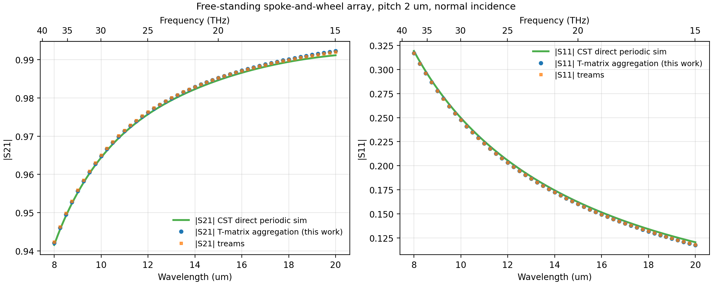
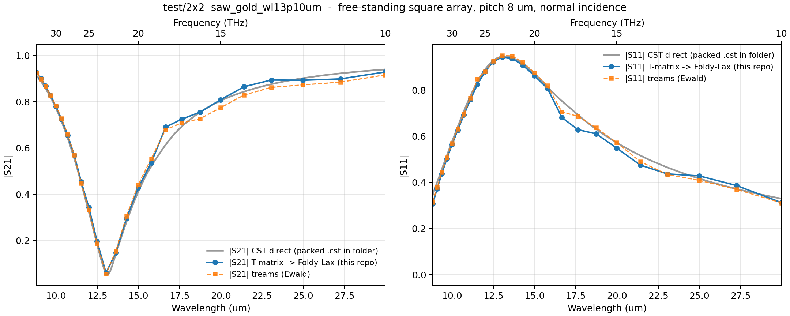

# Transition-Matrix Extraction and Macroscopic Metasurface Scattering

A multi-scale simulation pipeline for metasurfaces: extract the **transition
matrix (T-matrix)** of a single unit cell from one full-wave CST simulation,
then predict the S-parameters of arbitrarily large arrays with fast linear
algebra — no full-wave simulation of the array required.

The repeated cell may hold **one** meta-atom or **several different** ones, so a
metasurface can be composed out of measured atoms rather than simulated as a
whole.

This branch also checkpoints an **experimental inverse route** in `retrieval/`:
recovering an isolated, symmetry-constrained T-matrix from multimode Floquet
S-parameters, with explicit calibration and covariance gates. That route has
reached ideal-model identifiability at 8 µm, but it has **not** yet passed the
robust-recovery, independent-cell, or matched-speed acceptance gates described
below.

Validated end-to-end on the `dary` branch against direct CST periodic
simulations and the independent [treams](https://github.com/tfp-photonics/treams)
code: `test/single` (pitch 2 µm, 8–20 µm) to **|ΔS| ≤ 0.003** and **~3×10⁻⁴**
respectively, four single-atom `test/2x2` lattices (pitch 8 µm, 10–34 THz, a
resonant band) and five *mixed* supercells built from those measured atoms —
nine direct CST benchmarks in all. Seven of the nine agree to **mean |ΔS|
0.017–0.080**, limited by the input T-matrix rather than by the aggregation,
which reproduces an independent implementation to **10⁻¹²**. The two that do not
are documented failures with a diagnosed cause: they contain a pair of atoms
whose circumscribing spheres nearly touch, where the spherical addition theorem
converges too slowly to truncate. See [`experiment.md`](experiment.md).

<p align="center">

<br><em>test/single</em>
</p>
<p align="center">

<br><em>test/2x2: reconstruction (blue), treams (orange), direct CST (grey)</em>
</p>

### → [`experiment.md`](experiment.md): composing metasurfaces from measured meta-atoms

Four spoke-and-wheel resonators of different size, whose isolated T-matrices were
extracted separately, are combined in one repeated 16 µm cell — three two-species
checkerboards (`a,b;b,a`, `a,c;c,a`, `b,c;c,b`) and two arrangements of all four
at once (`a,b;c,d`, `a,d;b,c`). The pipeline predicts each mixed metasurface's
S-parameters; a direct CST simulation of that metasurface then checks the
prediction. Read [`experiment.md`](experiment.md) for the whole story — it is the
shortest route into what this repository does and how far it can be trusted.

<p align="center">

<br><em>All nine benchmarks. Markers are the T-matrix prediction, pale lines the
direct CST run of the same structure. Bottom right: accuracy against the
translation convergence ratio rho — above rho ~ 0.85 the method degrades, above
0.94 it breaks.</em>
</p>

Highlights: a mixed cell is **not** an interpolation of its constituents — each
species red-shifts onto the sparser 11.31 µm sublattice, and `a,c;c,a` grows a
hybrid resonance neither pure lattice has. Every two-species cell supports a
**dark lattice resonance** at the supercell's own Rayleigh condition that no
single-atom model can show, confirmed full-wave. Four *distinct* species break
that symmetry: the dark diffraction orders switch on 7.8 THz lower, the cell
becomes birefringent, and **rearranging the same four atoms changes |S21| by up
to 0.43** — `Σ_s T_s` is identical for the two arrangements and cannot tell them
apart. The write-up also takes the residual error apart into the mechanisms that
produce it, reproducibly (`aggregation/error_budget.py`), and documents the two
cases where the method breaks and why
([`OPEN_QUESTIONS.md`](OPEN_QUESTIONS.md) carries what is still unresolved).

---

## Experimental Floquet S → full T-matrix retrieval

The retrieval study asks whether a periodic CST experiment can recover the
complete isolated `lmax = 3` T-matrix without the conventional enclosing-field
projection. The stored matrix is 30×30; D4h symmetry plus reciprocity reduce it
to 40 independent complex coefficients per frequency. A deliberately
lower-symmetry cell and complete open-order Floquet S-matrix are used to expose
otherwise dark multipole sectors.

The current development incumbent is `small@8`, a six-order/24-channel design
near 8 µm. The errors below come from same-forward-model synthetic probes whose
families were normalized to a specular-derived discrepancy level; they are not
measured diffractive-channel covariance. The evidence is therefore encouraging
but still screening-level:

| check | current result | interpretation |
|---|---:|---|
| ideal noise-free D4h recovery | rank 40/40; numerical-error T recovery | algebraic identifiability demonstrated |
| iid perturbation | 5.15% global T error | approximately at, but not below, the 5% gate |
| mode-mixing perturbation | 4.27% | passes this synthetic stress direction only |
| smooth-angular / reference-plane perturbations | 19.88% / 23.99% | calibration aliases remain dominant |
| adversarial perturbation | 40.59% | robust recovery not demonstrated |
| nuisance-orthogonal weakest margin | about 3.5 vs required >10 | useful-direction SNR gate open |
| cost proxy | 78.5 min vs 49.1 min reference | matched-speed gate open |
| same approach at 20 µm | 117% iid / 801% systematic error | current per-frequency design is a no-go |

The strongest physics result is a conditional nuisance-model proof of concept:
jointly fitting the *correct* reference-plane offset reduced the `small@8`
error from 23.99% to 1.16%. In contrast, fitting uncalibrated nuisance freedom
raised the iid error from 5.4% to 130.6%. The next discriminating experiment is
therefore a frozen, held-out comparison of the full 40-D baseline against an
independently calibrated Au/geometry sector covariance and a shared-pole,
passive-residue prior with a nonzero full-space residual. No independent
physics-prior advantage is claimed yet.

Start with:

* [`retrieval/FAST_FULL_TMATRIX_WHEEL_PROPOSAL.md`](retrieval/FAST_FULL_TMATRIX_WHEEL_PROPOSAL.md) — method, milestones, and stop/go gates
* [`retrieval/fastfull/README.md`](retrieval/fastfull/README.md) — implementation and test entry points
* [`retrieval/results/fastfull/M1_DESIGN_STUDY.md`](retrieval/results/fastfull/M1_DESIGN_STUDY.md) — rank/SNR/cost screen
* [`retrieval/results/fastfull/GATE_A_STUDY.md`](retrieval/results/fastfull/GATE_A_STUDY.md) — blind synthetic stress study
* [`review.md`](review.md) — adversarial review history and unresolved evidence boundaries

Validation entry points, run from `retrieval/` in the `cst_inference`
environment:

```bash
python test_fastfull_core.py
python test_fastfull_design.py
python test_fastfull_ewald.py
python test_fastfull_synthetic.py  # search-heavy; about 8 minutes on the reviewed machine
```

This Git branch contains the retrieval source, tests, compact FastFull reports,
and small campaign metadata. Unpacked CST databases and the bulk generated
result tree remain local and are excluded by `.gitignore`.

---

## Pipeline overview

| Stage | What it does | Code | Status |
|---|---|---|---|
| **1. Near-field extraction** | Illuminates the *isolated* unit cell with a set of plane waves in CST (frequency-domain solver, open boundaries) and exports complex E/H on a spherical monitor | `extract_cst_near_fields_2.py` | main |
| **2. T-matrix projection** | Projects the recorded fields onto vector spherical wave functions (VSWFs) and solves F = T·A in least squares → `*.tmat.h5` | `compute_t_matrix_projection_2.py` | main |
| **3. Array aggregation → S-parameters** | Couples the per-cell T-matrices through the Foldy–Lax multiple-scattering equations (finite arrays or infinite lattices) and projects the collective response onto plane waves → S11/S21 | `aggregation/` | **this branch** |
| **3b. Heterogeneous supercell** | A repeated cell holding *several different* meta-atoms: pair-resolved Bloch coupling `W_st`, a block Foldy–Lax solve, and the full Floquet S-matrix over every open diffraction order | `aggregation/supercell.py` + `run_supercell.py` | **this branch** |

Theory reference: `ref/main.tex` (operational manual). The physics in one
breath: the scattering of one cell is the linear map `f = T a` between
incoming (regular) and outgoing VSWF coefficients; an array couples cells via
translation operators `A(d)`, giving the self-consistent system
`a^i = a_inc^i + Σ_j A(R_j−R_i) T a^j`; the summed outgoing far fields of a
subwavelength lattice collapse into the 0th diffraction order, giving
`S21 = 1 + (2πi/kA)·ê*·F(+ẑ)` and `S11 = (2πi/kA)·ê*·F(−ẑ)`.

## Repository layout

```
ref/                          theory manual (LaTeX + PDF)
test/single/                  demo unit cell: spoke-and-wheel gold resonator
  saw_gold_wl15p0025um.tmat.h5   49 freqs (8-20 um), lmax 3, tmat.h5 format
test/2x2/                     second case: same shape, four sizes, 8 um pitch
  saw_gold_wl10p90um_10to34THz.tmat.h5   atom C, scale 3.25 (packed run 10)
  saw_gold_wl13p10um_10to34THz.tmat.h5   atom A, scale 4.00 (run 6)
  saw_gold_wl17p30um_10to34THz.tmat.h5   atom B, scale 5.00 (run 2)
  saw_gold_wl23p50um_10to34THz.tmat.h5   atom D, scale 5.50 (run 3)
                              each 25 freqs (10-34 THz), lmax 5
  SAW_gold_noSub_packed.cst   packed CST project: 10-run parametric sweep
                              over `scale`, holding the periodic run that is
                              the direct reference for each atom
aggregation/                  Stage 3 implementation (this branch)
  vswf.py                     VSWF engine: fields, plane waves, far field, projections
  translate.py                translation operators + lattice sums (Richardson-extrapolated)
  aggregate.py                Foldy-Lax finite-array + periodic solves
  sparams.py                  S11/S21, energy balance, cross sections
  mirror.py                   PEC ground plane via exact image theory
  tmat_io.py                  tmat.h5 reader
  test_*.py                   validation suite (see table below)
  run_demo.py                 full 49-frequency demo (periodic + finite arrays)
  run_mirror_demo.py          ground-plane variant
  treams_reference.py         independent cross-check via treams
  cst_direct/                 direct CST periodic reference simulation
  results/                    figures, CSV/NPZ spectra
  REPORT.md                   results and findings
  IMPLEMENTATION_GUIDE.md     full tutorial: how this was built from scratch

  --- generic drivers: any tmat.h5 + pitch, no code edits ---
  run_case.py                 periodic sweep + convergence/finite-array checks,
                              with adaptive multipole truncation (--lmax auto)
  treams_case.py              treams cross-check for the same case
  cst_packed_reference.py     direct reference straight out of a packed *.cst
                              (no CST install needed; --list picks the run)
  plot_case.py                figures + agreement metrics for a results dir
  results_2x2/                the test/2x2 case (REPORT.md, CSV/NPZ, figures)

  --- Stage 3b: several different atoms in one repeated cell ---
  supercell.py                pair-resolved Bloch sums W_st, block solve,
                              full Floquet channels, finite-cluster T^O
  ewald_supercell.py          the same W_st by Ewald summation (the method the
                              heterogeneous case needs -- see below)
  run_supercell.py            driver: any list of tmat.h5 + positions + lattice
  treams_supercell.py         independent end-to-end treams reference
  test_supercell.py           the manual's 6.5.5 validation ladder
  error_budget.py             where the residual disagreement with CST comes
                              from, frequency by frequency
  compare_cases.py            all nine benchmarked cases in one table
  plot_supercell.py           per-case figures + agreement metrics
  plot_comparison.py          the whole study in one figure
  plot_experiment_summary.py  atoms vs mixed cells vs diffracted power
  cst_supercell/              direct CST benchmarks; --pair takes 2 or 4 atoms
  results_{A,B,C,D}_ewald_l3/ the four single-atom lattices
  results_2x2_super_l3/       a,b;b,a  (also the method REPORT for all cells)
  results_2x2_{AC,BC}_l3/     a,c;c,a and b,c;c,b
  results_2x2_{ABCD,ADBC}_l3/ a,b;c,d and a,d;b,c, four distinct species
  *_fine/                     the same sweeps on a 4x refined frequency grid

retrieval/                    experimental Floquet-S-to-isolated-T inverse route
  FAST_FULL_TMATRIX_WHEEL_PROPOSAL.md   feasibility hypothesis and gates
  fastfull/                   D4h basis, coded-cell design, Ewald and recovery code
  test_fastfull_*.py          direct validation entry points
  results/fastfull/           compact M1/M2 screening artifacts
  cst_runs/*.json             curated campaign metadata (raw CST trees stay local)
```

## Conventions (read this before touching anything)

All Stage-3 code follows the [tmat.h5 standard](https://doi.org/10.48550/arXiv.2404.10399)
exactly as declared by the data file:

* time dependence **e^(−iωt)**, outgoing radial functions **h_l^(1)**
* orthonormal spherical harmonics with **Condon–Shortley** phase
* Jackson-normalized VSWFs: `X = LY/√(l(l+1))`, `M = z_l X`, `N = (1/k)∇×M`
  — note N's radial term carries a factor **i** in this convention
* parity basis (TE/"magnetic" = M-waves, TM/"electric" = N-waves)
* `f = T a` (the file calls `f` "p"); mode order read from `/modes`, never assumed
* lmax = 3 → n = 2·lmax·(lmax+2) = 30 modes

## Quickstart

Requirements: Python with `numpy`, `scipy ≥ 1.15` (`sph_harm_y`), `h5py`,
`matplotlib`; optionally `treams` for the cross-check. CST is **not** needed
to run Stage 3.

```bash
cd aggregation
python test_vswf.py && python test_translate.py && python test_mirror.py   # validation suite
python run_demo.py        # ~8 min: 49 freqs, infinite lattice + finite arrays
python test_feature_fidelity.py
python plot_results.py    # figures + CSV into results/
```

Minimal API example — periodic array at normal incidence:

```python
from tmat_io import TMatrixData
from vswf import plane_wave_coeffs
from translate import lattice_sum_C, make_quad
from aggregate import solve_periodic
from sparams import sparams_normal, energy_balance

data = TMatrixData("../test/single/saw_gold_wl15p0025um.tmat.h5")
i = 21                                   # frequency index (~15 um)
k = data.k_at(i)                         # rad/um
C = lattice_sum_C(k, 2.0, data.modes, 0.8, make_quad())   # pitch 2 um
a_inc = plane_wave_coeffs([0, 0, 1], [1, 0, 0], data.modes)
a, f = solve_periodic(data.T[i], C, a_inc)
S = sparams_normal(k, 4.0, data.modes, f)                 # A_cell = 4 um^2
R, T, Aabs = energy_balance(S)
```

Finite arrays with arbitrary in-plane positions and per-site T-matrices:
`aggregate.build_finite_system` + `solve_finite`, then `sparams_normal` with
`A = N·A_cell`.

### Running a new case

`run_case.py` does the whole sweep for any `tmat.h5` plus a pitch, no code
edits. The `test/2x2` case, end to end (~2 min for the sweep):

```bash
cd aggregation
python run_case.py ../test/2x2/saw_gold_wl13p10um_10to34THz.tmat.h5 \
    --pitch 8.0 --r0 3.0 --lmax auto --finite 2 3 5 9 --out results_2x2
python treams_case.py ../test/2x2/saw_gold_wl13p10um_10to34THz.tmat.h5 \
    --pitch 8.0 --out results_2x2/treams_reference.npz --lmax auto
python cst_packed_reference.py ../test/2x2/SAW_gold_noSub_packed.cst --list
python cst_packed_reference.py ../test/2x2/SAW_gold_noSub_packed.cst \
    --run 6 --out results_2x2/cst_direct_reference.csv
python plot_case.py results_2x2
```

Two things that bite on a new case:

* **`--lmax auto`.** Translation operators grow like
  `h_l⁽¹⁾(k·pitch) ~ (2l−1)!!/(k·pitch)^(l+1)`, so on a deep-subwavelength
  lattice the high-l block of the lattice sum is enormous and amplifies
  whatever extraction noise sits in the high-l rows of `T`. For `test/2x2`
  (lmax 5, pitch 8 µm) `cond(I − C·T)` reaches 5×10⁵ at 11 THz and the answer
  comes out with negative absorption. `--lmax auto` keeps, per frequency, the
  largest truncation with `cond ≤ --cond-max` (100 by default) — lmax 3/4/5
  across that band — which restores A ≥ 0 without touching the well-conditioned
  part of the spectrum. See `results_2x2/REPORT.md`.
* **Parametric sweeps in a packed `.cst`.** Signals are versioned by the 3D Run
  ID; the newest is rarely the one you want. `--list` prints the run table
  (parameter values per run) so you can pick. `cst_packed_reference.py` reads
  the archive directly — it is a ZIP variant with `DE` signatures and 32-bit
  time/date fields, holding a SQLite result store — so no CST install is
  needed.

## Validation summary

### `test/single` — spoke-and-wheel, pitch 2 µm, lmax 3

| check | result |
|---|---|
| Mie sphere: optical theorem = ∫\|F\|² = Mie series | 3×10⁻¹⁵ |
| plane-wave reconstruction from VSWF expansion (E and H) | 3×10⁻⁸ |
| translation operator re-expansion / r₀-invariance | 2×10⁻⁷ / 3×10⁻⁷ |
| lattice-sum stability (taper set, quadrature, r₀) | ≤ 2×10⁻⁶ |
| input-file conventions: passivity max SV(I+2T) / reciprocity | 1.00007 / matches file's own metric |
| reciprocity of array S-params (S21 = S12) | 2×10⁻⁴ |
| finite arrays (5×5 → 13×13) → infinite-lattice limit | monotone ✓ |
| lossless array over PEC mirror: R = 1 (unitarity) | exact (1.000000) |
| **treams** (independent Ewald code), complex S, 49 freqs | ≤ 3.4×10⁻⁴ |
| **direct CST periodic simulation**, 8–20 µm | \|ΔS21\| ≤ 0.0011, \|ΔS11\| ≤ 0.0029 |

### `test/2x2` — same shape ×4, pitch 8 µm, lmax 5, 25 freqs

Run with `--lmax auto`; full write-up in
[`aggregation/results_2x2/REPORT.md`](aggregation/results_2x2/REPORT.md).

| check | result |
|---|---|
| r₀ (×0.8) and quadrature (20×40 → 28×56) invariance | ≤ 1.3×10⁻¹⁰ |
| lattice-sum taper length (kRc/1.4) | ≤ 4.3×10⁻³ |
| energy balance A = 1 − R − T | ≥ 0.010 (all 25 freqs) |
| **treams**, complex S | max 0.070, mean 0.019 |
| **direct CST periodic simulation** (run 6 of the sweep), complex S | max 0.078 / 0.077, mean 0.022 / 0.031 (S21 / S11) |
| resonance position vs direct CST | 13.097 µm vs 13.126 µm (0.2 %) |

The looser agreement is the input file's, not the aggregation's: this
T-matrix violates passivity by 2.8 % and reciprocity by up to 11 % (vs 0.007 %
and 0.6–1.2 % for `test/single`), and the largest error sits exactly at the
seam between its two merged extraction bands.

### Heterogeneous supercells — four atoms, five mixed cells, nine CST benchmarks

Method and full validation ladder in
[`aggregation/results_2x2_super_l3/REPORT.md`](aggregation/results_2x2_super_l3/REPORT.md);
per-cell results in the sibling `results_2x2_*_l3/REPORT.md`. Atoms A
(`scale` 4.00), B (5.00), C (3.25) and D (5.50) combined in a 16 µm repeated
cell at 8 µm atom pitch, 10–34 THz. `python aggregation/compare_cases.py --all`
prints every case in one table.

**The aggregation itself is exact.** Every algebraic identity the manual's
§6.5.5 ladder asks for holds to round-off, and an independent treams
implementation of the whole chain — its own cluster T-matrix, Ewald lattice
interaction and plane-wave projection — agrees on complex S and on the power
sums over all open orders:

| check | result |
|---|---|
| M = 1 reduces to the one-atom code (coupling, `f`, S11/S21) | bit-identical |
| 2×2 cell of four identical atoms ≡ the primitive lattice | ≤ 8×10⁻¹⁶ |
| basis-atom relabelling / whole-cell lattice shift | ≤ 7×10⁻¹⁶ / 0 |
| checkerboard selection rule: power in the odd (n1+n2) orders | ≤ 6×10⁻³³ |
| all T = 0 → S = S_bg exactly (manual §8 row 7) | 0 |
| finite-cluster T^O vs the multi-center far field, L_C = 14 | 1.9×10⁻⁹ |
| **independent treams implementation, every cell** | **≤ 1×10⁻¹²** |

**Against direct CST**, mean \|ΔS21\| for each of the nine benchmarks, ordered by
the addition theorem's convergence ratio ρ = (aᵢ + aⱼ)/d over the 8 µm
neighbour pairs:

| case | ρ | mean \|ΔS21\| | | case | ρ | mean \|ΔS21\| |
|---|---|---|---|---|---|---|
| C alone | 0.584 | 0.017 | | a,b;b,a | 0.809 | 0.046 |
| a,c;c,a | 0.652 | 0.019 | | B alone | 0.899 | 0.054 |
| A alone | 0.719 | 0.030 | | a,d;b,c | 0.854 | 0.080 |
| b,c;c,b | 0.742 | 0.036 | | D alone | 0.989 | **0.149** |
| | | | | a,b;c,d | 0.944 | **0.308** |

Seven of the nine land at 0.017–0.080, limited by the input T-matrices rather
than by the aggregation. The two that fail are documented, with the cause
diagnosed in [`experiment.md`](experiment.md): they contain a pair of atoms
whose circumscribing spheres nearly touch. Eq. (57) is *satisfied* there — the
addition theorem simply converges too slowly to truncate, since its error falls
like ρ^lmax and ρ = 0.99 buys 1 % per multipole order. Raising lmax makes it
worse, and treams reproduces the wrong answer to 10⁻¹⁵, which is the sharpest
demonstration in the study that cross-code agreement validates the
implementation and only full-wave validates the physics.

Three things the heterogeneous case forced:

* **The tapered lattice sum does not survive a sub-lattice shift.** The
  displacement-tapered blocks still satisfy `Σ_t W_st = C_p` to 10⁻¹⁵ — the
  taper error is common to all blocks and cancels in the sum, which is why the
  one-atom lattice was always accurate — but each *individual* block is only
  ~4×10⁻² converged at the default `kRc = (10, 14, 20)`, and a heterogeneous
  cell weights the blocks by different `T`s. `ewald_supercell.py` supplies them
  by Ewald summation instead (manual §6.5.3 sanctions exactly this), which is
  also 30× faster and reproduces the published one-atom `test/2x2` numbers
  exactly.
* **Diffraction is no longer optional.** A 16 µm cell has Rayleigh onsets at
  16 µm and 11.31 µm inside a band reaching 8.82 µm, so `run_supercell.py`
  reports every propagating Floquet order, not a scalar S11/S21.
* **The one-atom `--lmax auto` rule must not be reused.** `cond(I − W T₀)` for a
  supercell also contains the folded k∥ ≠ 0 bands, which are legitimately
  near-singular next to a Rayleigh anomaly, so capping it discards physics. The
  supercells run at fixed lmax 3.

## Key physical findings for the demo cell

* The free-standing 2 µm-pitch array is featureless in-band
  (|S21| 0.99→0.94): the *isolated* resonator has no resonance in 8–20 µm.
  The designed λc = 15 µm response is a **ground-plane (MIM) resonance** —
  Stage 1 removes the ground plane by design, so this is correct physics,
  confirmed by three independent computations.
* Adding a PEC ground plane by image theory (`mirror.py`) restores an
  absorption resonance near the design band at the design spacing
  (`results/fig6_mirror_absorber.png`) — qualitative, since the real
  dielectric spacer is not part of the extracted T-matrix.
* Practical CST warning (cost us two wrong runs): with `"unit cell"`
  boundaries CST sizes the period to the **geometry bounding box** unless
  `UnitCellFitToBoundingBox "False"` + `UnitCellDs1/Ds2` are set — an
  island-type cell silently becomes a *touching*, near-totally-reflective
  mesh. See `aggregation/cst_direct/` and REPORT.md §4b.

## Known limitations (Stage 3, current state)

* Normal incidence only (Bloch phases and the 1/cosθ port factor are
  documented extension points, not wired in).
* Square lattices for the periodic path; finite arrays take arbitrary
  in-plane positions.
* Multipole truncation is a real constraint, not a formality: on a
  deep-subwavelength lattice the Foldy–Lax system conditions like
  `(k·pitch)^(-(2lmax+2))`, so beyond some lmax the extra modes add noise
  rather than physics. `run_case.py --lmax auto` picks the budget per
  frequency; `run_demo.py` keeps the file's lmax = 3, which is safe there.
  Do **not** transplant `--lmax auto` to a supercell — see the section above.
* **Closely spaced atoms are the hard limit.** The outgoing→regular translation
  is a two-centre multipole expansion whose truncation error falls like ρ^lmax
  with ρ = (aᵢ + aⱼ)/d. Above ρ ≈ 0.85 accuracy degrades; above ρ ≈ 0.94 it
  breaks, and no truncation repairs it because the physics living in the gap
  cannot be written as multipoles about two separated centres. Manual §6.6
  names the fixes (plane-wave-mediated coupling, or a composite T-matrix
  enclosing the pair); neither is implemented. **The pipeline does not currently
  warn about this** — see [`OPEN_QUESTIONS.md`](OPEN_QUESTIONS.md) §3.
* Ground plane is an idealized PEC mirror with vacuum spacer; a layered
  substrate needs the Sommerfeld reflection operator (manual, Stage 2).

## Where to go next

* **Start here — one experiment, end to end**: [`experiment.md`](experiment.md)
  — composing metasurfaces out of separately measured meta-atoms, with the
  full-wave check at every step, and where the method stops working
* **What this did not settle**: [`OPEN_QUESTIONS.md`](OPEN_QUESTIONS.md) — four
  questions, each with the experiment that would close it
* **Results and figures**: [`aggregation/REPORT.md`](aggregation/REPORT.md)
* **The heterogeneous-supercell extension in detail**:
  [`aggregation/results_2x2_super_l3/REPORT.md`](aggregation/results_2x2_super_l3/REPORT.md)
* **How it was built, from scratch, with all the derivations and war
  stories**: [`aggregation/IMPLEMENTATION_GUIDE.md`](aggregation/IMPLEMENTATION_GUIDE.md)
