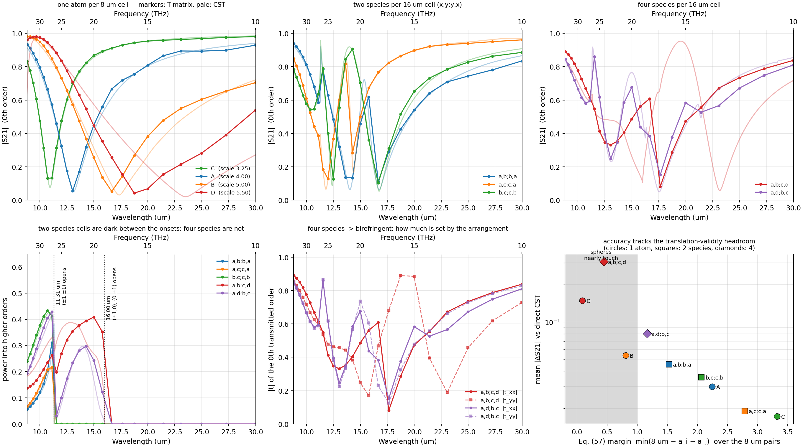

# Composing metasurfaces from measured meta-atoms

**Question.** Take meta-atoms whose isolated T-matrices we already have. Can we
predict the S-parameters of a metasurface built by *mixing* them — without
simulating that metasurface?

The pipeline up to this point could only repeat one atom. This experiment adds
the missing case and checks it against full-wave simulation at every step, on
**four** measured atoms and **five** mixed cells built from them — three
two-species checkerboards and two arrangements of all four at once. Nine direct
CST benchmarks in all.

<p align="center">

<br><em>The whole study. Top: the four single atoms, the three two-species
checkerboards, the two four-atom cells — markers are the T-matrix prediction,
pale lines the direct CST run of the same structure. Bottom: power into higher
diffraction orders (the checkerboards are dark between the two Rayleigh onsets,
the four-atom cells are not), the birefringence that four distinct species
introduces, and the accuracy of all nine benchmarks against the translation
convergence ratio.</em>
</p>

---

## The meta-atoms

All three are spoke-and-wheel gold resonators, 0.2 µm thick, from the parametric
family in `test/2x2/SAW_gold_noSub_packed.cst`. Their T-matrices were extracted
in isolation (PML boundaries, plane-wave illumination set) over 10–34 THz,
25 frequencies, lmax 5, vacuum embedding.

| | **A** | **B** | **C** | **D** |
|---|---|---|---|---|
| file | `…wl13p10um` | `…wl17p30um` | `…wl10p90um` | `…wl23p50um` |
| `scale` (3D Run ID) | 4.00 (run 6) | 5.00 (run 2) | 3.25 (run 10) | 5.50 (run 3) |
| ring outer radius | 2.877 µm | 3.596 µm | 2.338 µm | 3.956 µm |
| stored `residual` | 0.0024–0.0240 | 0.0039–0.0164 | 0.0045–0.0395 | 0.0045–0.0217 |
| stored `reciprocity` | 0.012–0.110 | 0.018–0.076 | 0.024–0.182 | 0.024–0.094 |
| passivity, max SV(I+2T) | 1.028 | 1.021 | 1.037 | 1.049 |

Because all three are members of the same packed parametric sweep, a direct CST
periodic reference already exists for each of them — no new simulation was
needed for step 1.

## The layout

Four atoms in a 16 × 16 µm repeated cell, 8 µm apart, one species on each
diagonal — written `x,y;y,x`:

```
        y
    +8  ┌───────────────┐
        │   y       x   │      x at (−4, −4) and (+4, +4)
     0  │               │      y at (+4, −4) and (−4, +4)
        │   x       y   │
    −8  └───────────────┘
       −8       0      +8   x
```

This is *not* simply "a 2×2 tile of a 16 µm cell". Both sublattices are square
lattices of constant 8√2 = 11.31 µm rotated by 45°, with one species sitting at
the body centre of the other, so the true point group is **C4v about an x site**.
Two things follow, and both turn out to be measurable:

* no cross-polarization at normal incidence;
* diffraction orders with `n1 + n2` odd are **extinguished exactly**. The
  coherent sum of manual Eq. (64) gives
  `F_x[1 + (−1)^{n1+n2}] + F_y[(−1)^{n1} + (−1)^{n2}]`, which vanishes for odd
  `n1 + n2` *whatever* F_x and F_y are — so this holds for any pair of species.
  The 16 µm cell's first Rayleigh onset (λ = 16 µm, 18.74 THz) therefore carries
  no power, and the first onset that does is λ = 16/√2 = 11.31 µm (26.50 THz).

---

## Step 1 — reconstruct each atom's own lattice, and check it

Each atom alone on an 8 µm square lattice, against its own direct CST run.

| | A | B | C | D |
|---|---|---|---|---|
| transmission minimum, this pipeline | 13.039 µm | 16.638 µm | 10.897 µm | 19.106 µm |
| transmission minimum, direct CST | 13.126 µm | 17.341 µm | 10.933 µm | 23.509 µm |
| resonance offset | −0.66 % | −4.05 % | **−0.33 %** | **−19 %** |
| complex S21, max / mean \|Δ\| | 0.062 / 0.030 | 0.121 / 0.054 | 0.035 / 0.017 | 0.466 / 0.149 |
| complex S11, max / mean \|Δ\| | 0.065 / 0.041 | 0.135 / 0.073 | 0.040 / 0.020 | 0.467 / 0.171 |
| vs the independent treams code | ≤ 1×10⁻¹² | ≤ 1×10⁻¹² | ≤ 1×10⁻¹² | ≤ 1×10⁻¹² |

Atom D fails, and it is the most informative result in the study — see
[§ "Where the method stops working"](#where-the-method-stops-working) below and
[`aggregation/results_D_ewald_l3/REPORT.md`](aggregation/results_D_ewald_l3/REPORT.md).

The reconstruction reproduces the lineshape, the depth and the full phase
excursion in every case; what varies is where the resonance sits.

**Atom B is the hard one, and the reason is the input file, not the
aggregation.** All three h5 files are merged from two extraction sub-bands, and
what matters is not a file's worst diagnostic but its quality *at its own
resonance*:

| | array dip | residual there | band-worst residual | mean \|ΔS21\| |
|---|---|---|---|---|
| atom A | 13.04 µm = 23.0 THz | 0.0042 | 0.0240 | 0.030 |
| atom B | 16.64 µm = 18.0 THz | **0.0103** | 0.0164 | 0.054 |
| atom C | 10.90 µm = 27.5 THz | 0.0071 | **0.0395** | **0.017** |

Atom C is the clearest case: it has the *worst* numbers in the file — residual to
0.040, reciprocity to 0.18, passivity 1.037 — and reconstructs *best*, because
all of those maxima sit at 10–20 THz where C is a tiny, deeply-Rayleigh scatterer
that barely contributes, while at its resonance the extraction is clean. Near a
resonance the Foldy–Lax denominator amplifies whatever error the input carries;
far from one it does not much matter.

## Step 2 — aggregate the array T-matrix

Two different objects, both produced, because "the T-matrix of the array" can
mean either:

**(a) The periodic aggregate** `T_B^loc(k∥) = [I − T₀W(k∥)]⁻¹ T₀`. Every atom
keeps its own T; the lattice interaction becomes a matrix of *pair-resolved*
Bloch sums

```
W_st(k∥) = Σ'_R  A(R + ρ_t − ρ_s) e^{i k∥·R}
```

where the prime removes only the (s = t, R = 0) self term — for s ≠ t the R = 0
term is the intracell coupling and must be kept. The self-consistent system is
`(I − W T₀) a = a_inc`, a 120 × 120 solve here (4 atoms × 30 modes at lmax 3).

**(b) The finite-cluster T-matrix** `T^O = Q (I − T₀U)⁻¹ T₀ P` — the same four
atoms taken as an isolated cluster, re-expanded about one global origin. This is
the literal "T-matrix of the whole array": a 336 × 336 matrix per frequency at
cluster order L_C = 12, in each cell's `cluster_T.npz`. Its far field matches the
direct multi-center sum to 1.7×10⁻⁷ at L_C = 12 and 1.9×10⁻⁹ at L_C = 14, where
it is also covariant under a shift of the expansion origin to 2.6×10⁻⁹.

They answer different questions. A finite cluster under an infinite plane wave
has a continuum of radiation channels and therefore no unique S11/S21, so `T^O`
is reported as a T-matrix and its spherical partial-wave S-matrix
`S_sph = I + 2T^O`; the S-parameters below belong to the periodic problem.

## Step 3 — S-parameters of the mixed metasurfaces

The collective multipoles of all four atoms are added coherently into every
propagating Floquet order,

```
E^±_G = (2πi / (A_uc k_z,G)) Σ_s e^{−i k^±_G·ρ_s} F_s(k̂^±_G)
```

power-normalized by √(k_z,G / k_z,in). Each cell's `periodic_results.csv` holds
the 0th order and R/T/A; `floquet_orders.csv` holds every order with its k_z,
complex TE/TM amplitude and power.

**A mixed cell is not an interpolation between its constituents.** Every species
moves to a sparser 11.31 µm sublattice, and its resonance red-shifts — by more
for the smaller, higher-frequency atom:

| resonance of | alone (8 µm) | in a,b;b,a | in a,c;c,a | in b,c;c,b |
|---|---|---|---|---|
| atom A | 13.04 µm | 13.95 | 14.42 | — |
| atom B | 16.64 µm | 16.88 | — | 16.71 |
| atom C | 10.90 µm | — | 11.84 | 12.44 |

and the three cells behave quite differently:

| cell | \|S21\| dips (µm) | A range | max diffracted |
|---|---|---|---|
| a,b;b,a | 16.88 (0.111), 13.95 (0.134) | [+0.040, +0.403] | 0.310 |
| a,c;c,a | 14.42 (0.283), 11.84 (0.128) | [+0.011, +0.356] | 0.216 |
| b,c;c,b | 16.71 (0.102), 12.44 (0.125) | [+0.028, +0.208] | 0.433 |
| a,b;c,d | 17.87 (0.081), 13.00 (0.331) | [+0.045, +0.208] | 0.409 |
| a,d;b,c | 17.64 (0.152), 13.09 (0.247) | [+0.048, **+0.487**] | **0.429** |

`b,c;c,b` diffracts hardest because C's resonance sits closest to the (±1,±1)
onset; `a,c;c,a` develops an extra **A–C hybrid resonance at 21.25 THz** with
absorption 0.42, present in neither pure lattice.

### A dark lattice resonance, in all three cells

At λ = 16.00 µm — the supercell's own Rayleigh condition — the near-field
coupling `W_st` is singular, but the responsible channels carry no far field, by
the same symmetry that makes them dark. On a 4× refined frequency grid
(`--refine 4`) every cell shows it at exactly the same place:

| cell | cond(I − W T₀) peak | at λ | diffracted there | A there |
|---|---|---|---|---|
| a,b;b,a | 1302 | 15.989 µm | 3.6×10⁻³⁰ | +0.349 |
| a,c;c,a | 594 | 15.989 µm | 3.8×10⁻³¹ | +0.081 |
| b,c;c,b | 1198 | 15.989 µm | 2.1×10⁻³⁰ | +0.209 |

The 8 µm primitive lattice has no Rayleigh onset until 8 µm and shows nothing at
all there. This feature exists only because the cell is a supercell, and its
strength depends on the contents while its position does not.

### Four distinct atoms: the symmetry breaks, and arrangement becomes a knob

The three cells above are all `x,y;y,x` checkerboards, C4v about one atom site.
Filling the four sites with four *different* atoms removes that symmetry, and
the 24 assignments collapse under the D4 symmetry of the site square to exactly
**three** distinct cells. Two of them were built.

**The dark orders switch on.** The coherent basis sum for the (±1,0)/(0,±1)
family is `i(F₁ − F₂ + F₃ − F₄)`; a checkerboard has F₁ = F₄ and F₂ = F₃ so it
cancels identically, and four different atoms do not:

| cell | power in the odd orders | first diffraction |
|---|---|---|
| all three two-species cells | ≤ 5×10⁻³¹ | 26.50 THz |
| a,b;c,d, a,d;b,c | **5×10⁻²** | **18.74 THz** |

The four-atom cells start diffracting 7.8 THz lower than any two-species cell
made from the same atoms — the dark window is gone, and CST confirms it (0.388
measured against 0.409 predicted for `a,b;c,d`).

**The cell becomes birefringent, by an amount the arrangement sets.**

| cell | max ‖t_xx\| − \|t_yy‖ | mean | max \|t_xy\| |
|---|---|---|---|
| a,b;c,d | **0.603** at 18.74 µm (0.286 vs 0.890) | 0.176 | 1.8×10⁻¹² |
| a,d;b,c | 0.168 | 0.037 | 1.5×10⁻¹² |

`a,b;c,d` is a strong linear polarizer near 18.7 µm; `a,d;b,c`, from the *same
four atoms*, is nearly isotropic. Cross-polarization stays zero in both — an
empirical cancellation tied to the square site arrangement, not to the code
(displacing one atom gives \|t_xy\| = 10⁻²). No symmetry argument for it is
offered; see [`OPEN_QUESTIONS.md`](OPEN_QUESTIONS.md) §2.

**Rearranging alone changes \|S21\| by up to 0.429** (mean 0.159). `Σ_s T_s` is
identical for the two cells and cannot tell them apart — the sharpest statement
in the study of why aggregation is a multiple-scattering solve.

## Step 4 — build the metasurfaces in CST and compare

For each cell, a 16 × 16 µm unit cell with the four resonators, every solver,
mesh, material and boundary setting copied from the packed project's own periodic
run, 20 Floquet modes per port. One **empty-cell companion run** — identical
geometry, no metal — serves all three: it measures the port-plane separation
(56.813 µm) and doubles as the manual's §8 background test. Each supercell took
about an hour on ~0.7–1.0 M tetrahedral DOF over ~48 adaptive frequency points.

### CST confirms the selection rule, in every cell

| cell | (0,0) carrier | (±1,0)/(0,±1) family | (±1,±1) family, CST vs predicted |
|---|---|---|---|
| a,b;b,a | 0.987 | **1.5×10⁻⁵** dark | 0.382 vs 0.310 |
| a,c;c,a | 1.002 | **1.5×10⁻⁵** dark | 0.208 vs 0.216 |
| b,c;c,b | 0.989 | **6.1×10⁻⁶** dark | 0.427 vs 0.433 |
| a,b;c,d | 0.971 | **0.388 bright** | 0.057 |
| a,d;b,c | 0.994 | **0.297 bright** | 0.335 |

The full-wave simulation puts nothing into the odd channels over the entire
18.7–34 THz window in which they are open — at the empty run's own noise floor.
A one-atom model of the same sheet cannot say anything about those channels at
all.

### Complex S-parameters

| cell | S21 max / mean | S11 max / mean | resonance offsets |
|---|---|---|---|
| a,b;b,a | 0.205 / 0.046 | 0.205 / 0.048 | +0.6 %, −1.8 % |
| a,c;c,a | 0.079 / **0.019** | 0.081 / 0.020 | −0.59 %, +0.45 % |
| b,c;c,b | 0.090 / 0.036 | 0.089 / 0.036 | **+0.44 %, +0.27 %** |
| a,d;b,c | 0.347 / 0.080 | 0.342 / 0.079 | +0.85 %, +0.38 % |
| **a,b;c,d** | **0.840 / 0.308** | 0.833 / 0.308 | **−10.2 %**, +3.4 % |

For `a,b;b,a` the 0.205 maximum comes entirely from the two samples that straddle
the 16 µm dark resonance; excluding them it is 0.068 / 0.063. For `a,c;c,a` the
maximum comes from the A–C hybrid at 21.25 THz; excluding 20.4–21.6 THz it is
0.064 / 0.017. `b,c;c,b` has no such spike — its 0.090 maximum is broadly
distributed, which is why its dips are the best placed of the three while its
mean is not the smallest.

The diffracted power is reproduced to 1.4 % relative for `b,c;c,b` (0.433 against
0.427) and 4 % for `a,c;c,a`, and `b,c;c,b` puts the least of all three into the
dark channels: 6.1×10⁻⁶ against a 0.989 carrier.

### The headline: mixing is free

| case | mean \|ΔS21\| vs its own direct CST run | mean \|ΔS11\| |
|---|---|---|
| atom C alone | 0.017 | 0.020 |
| a,c;c,a | 0.019 | 0.020 |
| atom A alone | 0.030 | 0.041 |
| b,c;c,b | 0.036 | 0.036 |
| a,b;b,a | 0.046 | 0.048 |
| atom B alone | 0.054 | 0.073 |
| a,d;b,c | 0.080 | 0.079 |
| atom D alone | 0.149 | 0.171 |
| a,b;c,d | 0.308 | 0.308 |

Every *two-species* mixed cell lands within the range of its two constituents.
`a,c;c,a` — the pair that reconstructs best individually — gives the best mixed
cell; `a,b;b,a`, which contains the worst constituent, gives the worst.
Aggregating two different atoms into one repeated cell costs nothing beyond what
the input T-matrices already cost.

That statement stops holding once atom D is involved, and the next section is
about why.

**Dilution helps the worst atom.** Atom B's resonance is placed 4.05 % wrong on
its own dense 8 µm lattice; in a mixed cell, where it sits on the sparser
11.31 µm sublattice, the same T-matrix places it to **+0.6 %** (`a,b;b,a`) and
**+0.44 %** (`b,c;c,b`). The 4 % was never the atom — it was the strong
collective shift of a dense lattice being computed from a slightly wrong T. Halve
the areal density and the lattice amplification that produced it halves too.

---

## Where the method stops working

Atom D is the largest of the four, and its own 8 µm lattice is where the method
fails: array resonance at 19.1 µm against 23.5 µm measured, a **19 % error**, and
absorption going negative. Diagnosing it corrected the framing used elsewhere in
this document.

**The T-matrix is innocent.** Asking each extracted T where its own *isolated*
atom resonates gives a perfectly linear size scaling — peak/scale = 3.766, 3.770,
3.786, 3.782 for C, A, B, D. D's T-matrix is fully consistent with its siblings,
and it is also the most dipolar of the four (96.5 % l = 1), so multipole
truncation is not the issue either. Raising lmax made things *worse*, not better.

**The array is where the anomaly lives.** A, B and C all blue-shift from their
isolated resonance to their 8 µm array resonance by a consistent 1.3–2.0 µm.
D red-shifts by +2.74 µm — opposite in sign. Across the whole packed parametric
sweep, array-dip/scale is flat at ≈ 3.3 while the neighbours are far apart and
then climbs as the gap closes:

| scale | gap between neighbours | CST array dip | dip / scale |
|---|---|---|---|
| 4.00 | 2.246 µm | 13.13 µm | 3.283 |
| 4.50 | 1.526 µm | 14.90 µm | 3.311 |
| 5.00 | 0.807 µm | 17.34 µm | 3.468 |
| **5.50** | **0.088 µm** | **23.51 µm** | **4.275** |

At scale 5.5 the rings are **88 nm** apart. That is the classic near-touching
capacitive red-shift — real physics in the full-wave model, and the same effect
that already makes atom B 4 % off while atom A is 0.7 %.

**Why the multipole method cannot follow it.** Manual Eq. (57) requires
‖rᵢ − rⱼ‖ > aᵢ + aⱼ, and that condition is *satisfied* in every case here — even
D–D at 8 µm (7.912 vs 8.000). Nothing is formally invalid. What varies is the
addition theorem's **convergence rate**: the truncation error falls like ρ^lmax
with ρ = (aᵢ + aⱼ)/d.

| case | worst pair | ρ | ρ³ | mean \|ΔS21\| |
|---|---|---|---|---|
| C alone | C–C | 0.584 | 0.200 | 0.017 |
| a,c;c,a | A–C | 0.652 | 0.277 | 0.019 |
| A alone | A–A | 0.719 | 0.372 | 0.030 |
| b,c;c,b | B–C | 0.742 | 0.408 | 0.036 |
| a,b;b,a | A–B | 0.809 | 0.530 | 0.046 |
| a,d;b,c | A–D | 0.854 | 0.623 | 0.080 |
| B alone | B–B | 0.899 | 0.727 | 0.054 |
| a,b;c,d | B–D | 0.944 | 0.841 | 0.308 |
| D alone | D–D | 0.989 | 0.967 | 0.149 |

At ρ = 0.989 each extra multipole order buys 1 %, so lmax of order 100 would be
needed — and long before that the lattice sum's amplification of the noisy
l = 4, 5 rows of T takes over. Two error sources moving in opposite directions
with lmax, which is exactly what D's lmax table shows. Marginally satisfied is
in practice worse than violated, because nothing warns you.

**And two independent codes agree on the wrong answer.** treams reproduces D's
reconstruction to 1.2×10⁻¹⁵, because it uses the same addition theorem and
inherits the same convergence limit. Agreement with treams validates the
*implementation*; only CST validates the *physics*.

The trend in ρ is strong but not strictly monotone — B alone beats `a,d;b,c`,
and D alone beats `a,b;c,d` — so ρ is the right diagnostic for *which regime you
are in* (above ~0.85 things degrade, above ~0.94 they break) rather than a
quantitative error law. ρ is also confounded with arrangement symmetry across
the two four-atom cells; [`OPEN_QUESTIONS.md`](OPEN_QUESTIONS.md) §1 specifies
the third arrangement that would separate them, and §3 notes that the pipeline
currently produces these answers with no warning at all.

## What the experiment does and does not establish

**Does.** The aggregation itself is exact: an independent treams implementation
of the whole chain — its own cluster T-matrix, its own Ewald lattice interaction,
its own plane-wave projection — agrees to **≤ 3×10⁻¹⁴ on complex S21** and
≤ 1×10⁻¹² on S11, for every cell, including the power sums over all nine open
orders. Every algebraic identity the manual's §6.5.5 ladder asks for holds to
round-off (40 checks in `aggregation/test_supercell.py`).

**Does not.** The absolute accuracy against full-wave is 2–5 % in complex S, and
that floor belongs to the input T-matrices, which violate passivity by 2.1–3.7 %
and reciprocity by 1.2–18 %. A better extraction moves this number; a better
aggregation does not. The next section takes that floor apart — it is not one
number but three mechanisms in three parts of the band.

## Where the remaining 2–5 % comes from

`aggregation/error_budget.py` takes any result directory and separates the two
things that decide how much of the input T-matrix's error survives into S: how
badly T is known (the h5's own stored `residual`, and the isolated scattering
cross section that sets its signal-to-noise) and how hard the lattice amplifies
it (|W| resolved by multipole order, and ‖(I − W T₀)⁻¹‖). It then propagates the
declared uncertainty end to end — perturb every site's T by a random matrix of
exactly the norm the file claims, re-run the whole aggregation, repeat.

### The error is not monotonic in wavelength

Atom A, complex |ΔS21| + |ΔS11| against its own CST run:

| λ (µm) | 29.98 | 24.98 | 18.74 | **16.66** | 13.63 | **11.10** | 9.99 | 8.82 |
|---|---|---|---|---|---|---|---|---|
| \|ΔS\| | 0.061 | 0.042 | 0.070 | **0.127** | 0.090 | **0.038** | 0.057 | 0.096 |

A U on both ends with a bump at the resonance — three different mechanisms, only
one of which is really "long wavelength".

### Long wavelength: a weak scatterer coupled through its near field

| λ (µm) | k·pitch | σ_sca (µm²) | h5 `residual` | \|W\| at l = 1 | l = 2 | l = 3 |
|---|---|---|---|---|---|---|
| 29.98 | 1.68 | 4.1 | **0.0240** | 4.5 | 39.8 | **1025** |
| 21.41 | 2.35 | 27.6 | 0.0182 | 2.2 | 8.8 | 112.8 |
| 13.63 | 3.69 | 120.9 | 0.0036 | 1.1 | 2.0 | 8.0 |
| 8.82 | 5.70 | 12.1 | 0.0154 | 1.5 | 1.4 | 1.7 |

* **The atom barely scatters.** σ_sca is 4.1 µm² at 30 µm against 121 µm² at
  13.6 µm. The extraction solves `F = T·A` in least squares, so when the
  scattered field is a small perturbation on the incident one, the same absolute
  near-field export noise becomes a much larger *relative* error in T. The file's
  own `residual` agrees: 0.0240 at 10 THz, its maximum over the band, against
  0.0024 at 19 THz.
* **The lattice amplifies exactly the rows that are worst determined.** The
  neighbour translation operator goes like `h_l⁽¹⁾(k·pitch) ~
  (2l−1)!!/(k·pitch)^(l+1)`, and k·pitch falls from 5.70 to 1.68 across the band.
  At 30 µm the atoms sit deep inside each other's *near* field: the l = 3
  coupling is 620× stronger than at the short end and 227× stronger than the
  dipole coupling at the same frequency. (This is the same effect that put
  `--lmax auto` into the one-atom driver, and why the supercells run at a fixed
  lmax 3.)

The two multiply. Propagating a T perturbation of the declared size predicts
|ΔS| ≈ 0.022–0.027 at 25–30 µm against 0.0014–0.0036 above 21 THz — a factor of
~10 from amplification alone, with the same relative input error.

### The resonance: a systematic error, not noise

The last column of `error_budget.py` is the ratio of observed to predicted. A
random perturbation is the most benign error of a given size — it has no
preferred direction, so it cannot move a resonance. Averaged over the outer
fifths of the band:

| case | long-λ: observed / predicted | ratio | short-λ | ratio |
|---|---|---|---|---|
| atom C alone | 0.0165 / 0.0116 | **1.4** | 0.0225 / 0.0032 | 6.9 |
| atom A alone | 0.0555 / 0.0231 | **2.4** | 0.0754 / 0.0034 | 22.1 |
| atom B alone | 0.1558 / 0.0400 | **3.9** | 0.0982 / 0.0037 | 26.8 |
| b,c;c,b | 0.0302 / 0.0215 | **1.4** | 0.0561 / 0.0017 | 32.9 |
| a,c;c,a | 0.0374 / 0.0095 | 4.0 | 0.0330 / 0.0016 | 20.4 |
| a,b;b,a | 0.0727 / 0.0210 | 3.5 | 0.0961 / 0.0018 | 54.5 |

At the long-wavelength end the noise model explains a quarter to three quarters
of what is observed. In the middle of the band the observed error runs 15–90×
the prediction, and no perturbation of that norm can produce it: the dominant
error there is a **systematic bias**, in practice a pole slightly off frequency,
which shows up hardest where the response varies fastest.

The three atoms make that a trend rather than a coincidence — the ratio tracks
the resonance offset. Atom C has the smallest pole error (−0.33 %) and the ratio
closest to 1; atom B has the largest of both (−4.05 %, ratio 3.9).

### Short wavelength: the array's own Rayleigh anomaly

λ_min/pitch = 1.10, so the 8 µm lattice is approaching its own diffraction edge
at the top of the band. ‖(I − W T₀)⁻¹‖ climbs from ~1.5 near 10 µm to 20.9 for
atom A and 27.9 for atom B. That is the *lattice* becoming resonant, not the
atom, and no better T-matrix fixes it.

### What each one would take to fix

| where | cause | remedy |
|---|---|---|
| long λ | weak scatterer → poor extraction SNR, multiplied by a near-field lattice sum | raise the SNR of the extraction there: more illuminations, larger monitor radius, tighter mesh |
| resonance | pole position slightly wrong in the extracted T | sample the extraction finer around the pole |
| short λ | the array approaches λ = pitch | larger pitch, or an Ewald treatment tuned near the anomaly |

None of the three is the aggregation, which reproduces an independent
implementation to 10⁻¹² across the whole band.

---

## Two other things worth knowing

**One thing that had to change.** The repository's Gaussian-taper + Richardson
lattice sum does not survive a sub-lattice shift. Tapering the full displacement
keeps `Σ_t W_st = C_p` exact to 10⁻¹⁵, but each individual pair block is only
~4×10⁻² converged at the default taper set: the error is common to all blocks and
cancels in the sum, which is why the one-atom lattice was always accurate and why
a heterogeneous cell, whose blocks are weighted by *different* T's, cannot use
them. Ewald summation replaces it, reproduces the published one-atom `test/2x2`
numbers exactly, and is 30× faster.

**A trap worth repeating.** Cross-code comparisons must use the same incidence
direction. Illuminating from −z instead of +z changes the answer by 0.01–0.06 in
complex S here — that is the input T-matrix's own up/down asymmetry, tracking its
stored `reciprocity` diagnostic, not an implementation difference. With matching
incidence the two codes agree to 10⁻¹².

## Reproducing it

CST is needed only for step 4; steps 1–3 run in seconds from the h5 files.

```bash
cd aggregation
H5=../test/2x2
A=$H5/saw_gold_wl13p10um_10to34THz.tmat.h5
B=$H5/saw_gold_wl17p30um_10to34THz.tmat.h5
C=$H5/saw_gold_wl10p90um_10to34THz.tmat.h5

# validation ladder (40 checks; --taper adds the tapered-sum comparison)
python test_supercell.py

# step 1: each atom alone, against its own direct CST run (runs 6, 2, 10)
python run_supercell.py --cell 8 --site $A 0 0 --lmax 3 --out results_A_ewald_l3
python cst_packed_reference.py $H5/SAW_gold_noSub_packed.cst --run 6 \
    --out results_A_ewald_l3/cst_direct_reference.csv
#   ... likewise B with run 2 and C with run 10

# steps 2-3: the mixed cells, plus the finite-cluster T^O
python run_supercell.py --cell 16 --site $A -4 -4 --site $A 4 4 \
                                  --site $B  4 -4 --site $B -4 4 \
    --lmax 3 --cluster-lmax 12 --out results_2x2_super_l3
#   ... likewise --pair AC and BC into results_2x2_AC_l3 / results_2x2_BC_l3

# independent cross-check, and the refined grid that resolves the dark resonance
python treams_supercell.py --cell 16 --site ... --lmax 3 --out <dir>/treams_reference.npz
python run_supercell.py --cell 16 --site ... --lmax 3 --refine 4 --out <dir>_fine

# step 4: CST (needs an installation; ~1 h per supercell, ~5 min for the empty cell)
python cst_supercell/build_2x2_supercell.py --pair AB --only empty   # once, shared
python cst_supercell/build_2x2_supercell.py --pair AB --only supercell
python cst_supercell/read_supercell_results.py \
    --run cst_supercell/runs_AB/supercell/supercell.cst \
    --empty cst_supercell/runs/empty/empty.cst --out results_2x2_super_l3

# figures, metrics and the error budget
python plot_supercell.py results_2x2_super_l3 --fine results_2x2_super_fine
python plot_experiment_summary.py
python compare_cases.py --all
python error_budget.py results_2x2_super_l3
```

Long CST solves must be launched **detached** (PowerShell `Start-Process`), not
from a shell with a timeout — killing the parent takes the CST DesignEnvironment
with it mid-solve and the error reads exactly like a solver crash.

## Where everything is

| | |
|---|---|
| method, derivation, full validation ladder | [`aggregation/results_2x2_super_l3/REPORT.md`](aggregation/results_2x2_super_l3/REPORT.md) |
| per-cell results | `aggregation/results_2x2_{super,AC,BC}_l3/REPORT.md` |
| S-parameters, 0th order | `<dir>/periodic_results.csv` |
| every Floquet order | `<dir>/floquet_orders.csv` |
| direct CST, de-embedded | `<dir>/cst_direct_supercell*.csv` |
| finite-cluster `T^O` | `<dir>/cluster_T.npz` (not in git; regenerate with `--cluster-lmax`) |
| the CST projects | `aggregation/cst_supercell/runs*/` (`*.cst` + model history + solver log; working directories not in git) |
| the error budget | `aggregation/error_budget.py` |
| the algorithm | manual §6.5.2–6.5.5 and §7.5, implemented in `aggregation/supercell.py` |
| all nine cases in one table | `python aggregation/compare_cases.py --all` |
| the comparison figure | `aggregation/plot_comparison.py` |
| what is still unresolved | [`OPEN_QUESTIONS.md`](OPEN_QUESTIONS.md) |
