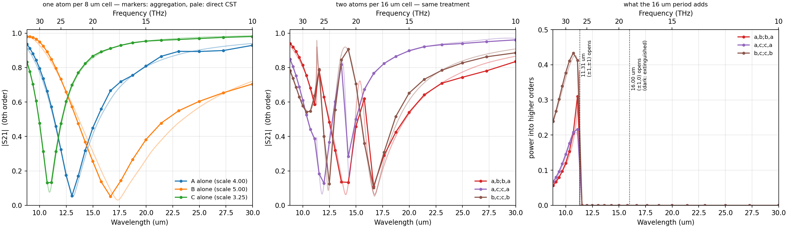

# The `a,b;b,a` experiment — two measured meta-atoms, one mixed metasurface

**Question.** Take two *different* meta-atoms whose isolated T-matrices we
already have. Can we predict the S-parameters of a metasurface built by mixing
them — without simulating that metasurface?

The pipeline up to this point could only repeat one atom. This experiment adds
the missing case and checks it against full-wave simulation at every step.

<p align="center">

<br><em>Left/middle: the two pure lattices and the mixed one, each over its own
direct CST run (pale). Right: the diffracted power of the mixed cell — exactly
zero between the two Rayleigh onsets, because the a,b;b,a symmetry makes those
channels dark.</em>
</p>

---

## The two meta-atoms

Both are spoke-and-wheel gold resonators, 0.2 µm thick, from the parametric
family in `test/2x2/SAW_gold_noSub_packed.cst`. Their T-matrices were extracted
in isolation (PML boundaries, plane-wave illumination set) over 10–34 THz,
25 frequencies, lmax 5, vacuum embedding.

| | atom **A** | atom **B** |
|---|---|---|
| file | `saw_gold_wl13p10um_10to34THz.tmat.h5` | `saw_gold_wl17p30um_10to34THz.tmat.h5` |
| packed-project `scale` | 4.0 (3D Run ID 6) | 5.0 (3D Run ID 2) |
| ring outer radius | 2.877 µm | 3.596 µm |
| its own direct CST run | run 6 of the sweep | run 2 of the sweep |

Because both atoms are members of the same packed parametric sweep, a direct
CST periodic reference already exists for each of them — no new simulation was
needed for step 1.

## The layout

Four atoms in a 16 × 16 µm repeated cell, 8 µm apart, A on one diagonal and B
on the other:

```
        y
    +8  ┌───────────────┐
        │   B       A   │      A = scale 4.0   at (−4, −4), (+4, +4)
     0  │               │      B = scale 5.0   at (+4, −4), (−4, +4)
        │   A       B   │
    −8  └───────────────┘
       −8       0      +8   x
```

This is *not* simply "a 2×2 tile of a 16 µm cell". Both sublattices are square
lattices of constant 8√2 = 11.31 µm rotated by 45°, with B sitting at the body
centre of A, so the true point group is **C4v about an A site**. Two things
follow, and both turn out to be measurable:

* no cross-polarization at normal incidence;
* diffraction orders with `n1 + n2` odd are **extinguished exactly**, so the
  16 µm cell's first Rayleigh onset (λ = 16 µm, 18.74 THz) carries no power and
  the first onset that does is λ = 16/√2 = 11.31 µm (26.50 THz).

---

## Step 1 — reconstruct each atom's own lattice, and check it

Each atom alone on an 8 µm square lattice, aggregated and compared with its own
direct CST run.

| | atom A | atom B |
|---|---|---|
| transmission minimum, this pipeline | 13.039 µm | 16.638 µm |
| transmission minimum, direct CST | 13.126 µm | 17.341 µm |
| resonance offset | −0.66 % | **−4.05 %** |
| complex S21, max / mean \|Δ\| | 0.062 / 0.030 | 0.121 / 0.054 |
| complex S11, max / mean \|Δ\| | 0.065 / 0.041 | 0.135 / 0.073 |
| vs the independent treams code | 6×10⁻¹⁶ / 1×10⁻¹² | 8×10⁻¹⁶ / 1×10⁻¹² |

The reconstruction reproduces the lineshape, the depth and the full phase
excursion; what it gets wrong is where the resonance sits. **Atom B is the
harder of the two, and the reason is the input file, not the aggregation.**
Both h5 files are merged from two extraction sub-bands. Atom A's array
resonance (22.9 THz) falls in its *better* sub-band; atom B's (17.3 THz) falls
in its *worse* one:

| | 10–20 THz sub-band | 21–34 THz sub-band |
|---|---|---|
| atom A, mean (\|ΔS21\| + \|ΔS11\|) vs CST | 0.071 | 0.071 |
| atom B, mean (\|ΔS21\| + \|ΔS11\|) vs CST | **0.184** | 0.082 |

Near a resonance the Foldy–Lax denominator amplifies whatever error the input
carries. Two controls confirm this reading: symmetrizing each T to enforce
reciprocity moves the answer by only 0.007 (mean), and a uniform rescaling of
the wavelength axis — a pure pole shift — barely helps (0.127 → 0.124 mean), so
the residual is a distributed amplitude-and-phase error of the extracted T,
largest where that T is most resonant.

## Step 2 — aggregate the array T-matrix

Two different objects, both produced, because "the T-matrix of the array" can
mean either:

**(a) The periodic aggregate** `T_B^loc(k∥) = [I − T₀W(k∥)]⁻¹ T₀`. Every atom
keeps its own T; the lattice interaction becomes a matrix of *pair-resolved*
Bloch sums

```
W_st(k∥) = Σ'_R  A(R + ρ_t − ρ_s) e^{i k∥·R}
```

where the prime removes only the (s = t, R = 0) self term — for s ≠ t the R = 0
term is the intracell coupling and must be kept. The self-consistent system is
`(I − W T₀) a = a_inc`, a 120 × 120 solve here (4 atoms × 30 modes at lmax 3).

**(b) The finite-cluster T-matrix** `T^O = Q (I − T₀U)⁻¹ T₀ P` — the same four
atoms taken as an isolated cluster, re-expanded about one global origin. This
is the literal "T-matrix of the whole array": a 336 × 336 matrix per frequency
at cluster order L_C = 12, in `results_2x2_super_l3/cluster_T.npz`. Its far
field matches the direct multi-center sum to 1.7×10⁻⁷ at L_C = 12 and
1.9×10⁻⁹ at L_C = 14, where it is also covariant under a shift of the expansion
origin to 2.6×10⁻⁹.

They answer different questions. A finite cluster under an infinite plane wave
has a continuum of radiation channels and therefore no unique S11/S21, so `T^O`
is reported as a T-matrix and its spherical partial-wave S-matrix
`S_sph = I + 2T^O`; the S-parameters below belong to the periodic problem.

## Step 3 — S-parameters of the mixed metasurface

The collective multipoles of all four atoms are added coherently into every
propagating Floquet order,

```
E^±_G = (2πi / (A_uc k_z,G)) Σ_s e^{−i k^±_G·ρ_s} F_s(k̂^±_G)
```

power-normalized by √(k_z,G / k_z,in). Results in
[`periodic_results.csv`](aggregation/results_2x2_super_l3/periodic_results.csv)
(0th order, R/T/A) and
[`floquet_orders.csv`](aggregation/results_2x2_super_l3/floquet_orders.csv)
(every order: k_z, complex TE/TM amplitude, power).

| f (THz) | λ (µm) | \|S11\| | \|S21\| | R | T | A | open orders | diffracted |
|---|---|---|---|---|---|---|---|---|
| 10 | 29.98 | 0.459 | 0.835 | 0.211 | 0.697 | 0.093 | 1 | 0 |
| 14 | 21.41 | 0.705 | 0.642 | 0.498 | 0.413 | 0.090 | 1 | 0 |
| 18 | 16.66 | 0.891 | 0.111 | 0.793 | 0.012 | 0.194 | 1 | 0 |
| 19 | 15.78 | 0.462 | 0.619 | 0.213 | 0.384 | 0.403 | 5 | 0 |
| 22 | 13.63 | 0.929 | 0.136 | 0.863 | 0.018 | 0.118 | 5 | 0 |
| 27 | 11.10 | 0.533 | 0.585 | 0.439 | 0.498 | 0.062 | 9 | 0.310 |
| 34 | 8.82 | 0.145 | 0.939 | 0.048 | 0.912 | 0.040 | 9 | 0.057 |

**The mixed cell is not an interpolation between the two pure ones.** Alone, A
dips at 23 THz (|S21| = 0.055) and B at 18 THz (0.052). Mixed at half the areal
density each, the dips move to 18 THz (0.111) and 21–22 THz (0.134): 5 THz of
separation becomes 3.5 THz. And between them, at 19–20 THz, transmission does
not stay low — it rises back to 0.62.

That window is a **dark lattice resonance** at the supercell's own Rayleigh
condition, λ = 16.00 µm. The near-field coupling `W_st` is singular there, but
the responsible channels carry no far field, by the same symmetry that makes
them dark. Scanning finely (`--refine 4`):

| f (THz) | λ (µm) | cond(I − W T₀) | \|S21\| | A | diffracted |
|---|---|---|---|---|---|
| 18.00 | 16.655 | 271 | 0.111 | 0.194 | 0 |
| **18.75** | **15.989** | **1302** | 0.429 | 0.349 | 3.6×10⁻³⁰ |
| 19.25 | 15.574 | 227 | 0.682 | **0.436** | 1.2×10⁻³⁰ |
| 20.00 | 14.990 | 83 | 0.457 | 0.212 | 1.4×10⁻³⁰ |

The 8 µm primitive lattice has no Rayleigh onset until 8 µm and shows nothing
at all there. This feature exists only because the cell is a supercell.

## Step 4 — build the metasurface in CST and compare

A 16 × 16 µm unit cell with the four resonators, every solver, mesh, material
and boundary setting copied from the packed project's own periodic run, 20
Floquet modes per port, plus an **empty-cell companion run** that measures the
port-plane separation (56.813 µm) and doubles as a background test. 48
adaptively placed frequency points, 3863 s, ~1.0 M tetrahedral DOF.

### CST confirms the selection rule

| Floquet family | opens at | direct CST | predicted |
|---|---|---|---|
| (0,0) | — | 0.987 | — |
| (±1,0), (0,±1) | 18.74 THz | **1.5×10⁻⁵** | **0 (dark)** |
| (±1,±1) | 26.50 THz | 0.382 | 0.310 |
| (±2,0), (0,±2) | 37.47 THz | 0 (closed) | 0 (closed) |

The full-wave simulation puts nothing into the odd channels over the entire
18.7–34 THz window in which they are open — at the empty run's own noise floor.
A one-atom model of the same sheet cannot say anything about those channels at
all.

### CST confirms the dark resonance

| feature | this pipeline | direct CST | offset |
|---|---|---|---|
| B-derived transmission dip | 16.655 µm, \|S21\| 0.111 | 16.752 µm, 0.063 | +0.6 % |
| A-derived transmission dip | 14.276 µm, \|S21\| 0.134 | 14.025 µm, 0.062 | −1.8 % |
| dark lattice resonance peak | 15.574 µm, \|S21\| 0.682 | 15.352 µm, 0.723 | +1.4 % |
| (±1,±1) diffraction edge | 11.31 µm | 11.31 µm | exact |

| | max | mean |
|---|---|---|
| complex S21 vs CST | 0.205 | 0.046 |
| complex S11 vs CST | 0.205 | 0.048 |
| … excluding the two samples straddling the 16 µm resonance | 0.068 / 0.063 | 0.036 / 0.038 |

### The headline: the supercell step is free

| case | mean \|ΔS21\| vs its own direct CST run | mean \|ΔS11\| |
|---|---|---|
| atom A alone, 8 µm lattice | 0.030 | 0.041 |
| atom B alone, 8 µm lattice | 0.054 | 0.073 |
| **a,b;b,a supercell, 16 µm cell** | **0.046** | **0.048** |

The mixed cell lands *between* its two constituents, and its resonance
positions are better placed (+0.6 %, −1.8 %) than atom B's own lattice manages
(−4.05 %). Aggregating two different atoms into one repeated cell costs nothing
beyond what the input T-matrices already cost.

---

## What the experiment does and does not establish

**Does.** The aggregation itself is exact: an independent treams implementation
of the whole chain — its own cluster T-matrix, its own Ewald lattice
interaction, its own plane-wave projection — agrees to **1×10⁻¹²** on complex S
and on the power sums over all nine open orders. Every algebraic identity the
manual's §6.5.5 ladder asks for holds to round-off (40 checks in
`aggregation/test_supercell.py`).

**Does not.** The absolute accuracy against full-wave is 2–5 % in complex S,
and that floor belongs to the two input T-matrices, which violate passivity by
2.1–2.8 % and reciprocity by 2–11 %. A better extraction moves this number; a
better aggregation does not. The next section takes that floor apart — it is not
one number but three mechanisms in three parts of the band.

## Where the remaining 2–5 % comes from

`aggregation/error_budget.py` takes any result directory and separates the two
things that decide how much of the input T-matrix's error survives into S: how
badly T is known (the h5's own stored `residual`, and the isolated scattering
cross section that sets its signal-to-noise) and how hard the lattice amplifies
it (|W| resolved by multipole order, and ‖(I − W T₀)⁻¹‖). It then propagates the
declared uncertainty end to end — perturb every site's T by a random matrix of
exactly the norm the file claims, re-run the whole aggregation, repeat.

### The error is not monotonic in wavelength

Atom A, complex |ΔS21| + |ΔS11| against its own CST run:

| λ (µm) | 29.98 | 24.98 | 18.74 | **16.66** | 13.63 | **11.10** | 9.99 | 8.82 |
|---|---|---|---|---|---|---|---|---|
| \|ΔS\| | 0.061 | 0.042 | 0.070 | **0.127** | 0.090 | **0.038** | 0.057 | 0.096 |

A U on both ends with a bump at the resonance — three different mechanisms, only
one of which is really "long wavelength".

### Long wavelength: a weak scatterer coupled through its near field

Two effects compound there, and both are visible in the run:

| λ (µm) | k·pitch | σ_sca (µm²) | h5 `residual` | \|W\| at l = 1 | l = 2 | l = 3 |
|---|---|---|---|---|---|---|
| 29.98 | 1.68 | 4.1 | **0.0240** | 4.5 | 39.8 | **1025** |
| 21.41 | 2.35 | 27.6 | 0.0182 | 2.2 | 8.8 | 112.8 |
| 13.63 | 3.69 | 120.9 | 0.0036 | 1.1 | 2.0 | 8.0 |
| 8.82 | 5.70 | 12.1 | 0.0154 | 1.5 | 1.4 | 1.7 |

* **The atom barely scatters.** σ_sca is 4.1 µm² at 30 µm against 121 µm² at
  13.6 µm. The extraction solves `F = T·A` in least squares, so when the
  scattered field is a small perturbation on the incident one, the same absolute
  near-field export noise becomes a much larger *relative* error in T. The
  file's own `residual` agrees: 0.0240 at 10 THz, its maximum over the band,
  against 0.0024 at 19 THz.
* **The lattice amplifies exactly the rows that are worst determined.** The
  neighbour translation operator goes like `h_l⁽¹⁾(k·pitch) ~
  (2l−1)!!/(k·pitch)^(l+1)`, and k·pitch falls from 5.70 to 1.68 across the
  band. At 30 µm the atoms sit deep inside each other's *near* field: the l = 3
  coupling is 620× stronger than at the short end and 227× stronger than the
  dipole coupling at the same frequency. (This is the same effect that put
  `--lmax auto` into the one-atom driver, and why the supercell runs at a fixed
  lmax 3.)

The two multiply. Propagating a T perturbation of the declared size predicts
|ΔS| ≈ 0.022–0.027 at 25–30 µm against 0.0014–0.0036 above 21 THz — a factor of
~10 from amplification alone, with the same relative input error.

### The resonance: a systematic error, not noise

The last column of `error_budget.py` is the ratio of observed to predicted. A
random perturbation is the most benign error of a given size — it has no
preferred direction, so it cannot move a resonance. Averaged over the outer
fifths of the band:

| case | long-λ fifth: observed / predicted | ratio | short-λ fifth | ratio |
|---|---|---|---|---|
| atom A alone | 0.0555 / 0.0231 | **2.4** | 0.0754 / 0.0034 | 22.1 |
| atom B alone | 0.1558 / 0.0400 | **3.9** | 0.0982 / 0.0037 | 26.8 |
| a,b;b,a supercell | 0.0727 / 0.0210 | **3.5** | 0.0961 / 0.0018 | 54.5 |

At the long-wavelength end the noise model explains a quarter to a half of what
is observed — as close as it gets anywhere. In the middle of the band the
observed error runs 15–90× the prediction, and no perturbation of that norm can
produce it: the dominant error there is a **systematic bias**, in practice a
pole slightly off frequency, which shows up hardest where the response varies
fastest. That is why atom B is the worse of the two overall — its resonance sits
at 17.3 THz, inside its poorer extraction sub-band.

### Short wavelength: the array's own Rayleigh anomaly

λ_min/pitch = 1.10, so the 8 µm lattice is approaching its own diffraction edge
at the top of the band. ‖(I − W T₀)⁻¹‖ climbs from ~1.5 near 10 µm to 20.9 for
atom A and 27.9 for atom B. That is the *lattice* becoming resonant, not the
atom, and no better T-matrix fixes it.

### What each one would take to fix

| where | cause | remedy |
|---|---|---|
| long λ | weak scatterer → poor extraction SNR, multiplied by a near-field lattice sum | raise the SNR of the extraction there: more illuminations, larger monitor radius, tighter mesh |
| resonance | pole position slightly wrong in the extracted T | sample the extraction finer around the pole |
| short λ | the array approaches λ = pitch | larger pitch, or an Ewald treatment tuned near the anomaly |

None of the three is the aggregation, which reproduces an independent
implementation to 10⁻¹² across the whole band.

---

## Two other things worth knowing

**One thing that had to change.** The repository's Gaussian-taper + Richardson
lattice sum does not survive a sub-lattice shift. Tapering the full displacement
keeps `Σ_t W_st = C_p` exact to 10⁻¹⁵, but each individual pair block is only
~4×10⁻² converged at the default taper set: the error is common to all blocks
and cancels in the sum, which is why the one-atom lattice was always accurate
and why a heterogeneous cell, whose blocks are weighted by *different* T's,
cannot use them. Ewald summation replaces it, reproduces the published one-atom
`test/2x2` numbers exactly, and is 30× faster.

**A trap worth repeating.** Cross-code comparisons must use the same incidence
direction. Illuminating from −z instead of +z changes the answer by 0.01–0.06 in
complex S here — that is the input T-matrix's own up/down asymmetry, tracking
its stored `reciprocity` diagnostic, not an implementation difference. With
matching incidence the two codes agree to 10⁻¹².

## Reproducing it

CST is needed only for step 4; steps 1–3 run in seconds from the h5 files.

```bash
cd aggregation

# validation ladder (40 checks; --taper adds the tapered-sum comparison)
python test_supercell.py

# step 1: each atom alone, against its own direct CST run
python run_supercell.py --cell 8 --site ../test/2x2/saw_gold_wl13p10um_10to34THz.tmat.h5 0 0 \
    --lmax 3 --out results_A_ewald_l3
python run_supercell.py --cell 8 --site ../test/2x2/saw_gold_wl17p30um_10to34THz.tmat.h5 0 0 \
    --lmax 3 --out results_B_ewald_l3
python cst_packed_reference.py ../test/2x2/SAW_gold_noSub_packed.cst --run 6 \
    --out results_A_ewald_l3/cst_direct_reference.csv
python cst_packed_reference.py ../test/2x2/SAW_gold_noSub_packed.cst --run 2 \
    --out results_B_ewald_l3/cst_direct_reference.csv

# steps 2-3: the checkerboard, plus the finite-cluster T^O
python run_supercell.py --cell 16 \
    --site ../test/2x2/saw_gold_wl13p10um_10to34THz.tmat.h5 -4 -4 \
    --site ../test/2x2/saw_gold_wl17p30um_10to34THz.tmat.h5  4 -4 \
    --site ../test/2x2/saw_gold_wl17p30um_10to34THz.tmat.h5 -4  4 \
    --site ../test/2x2/saw_gold_wl13p10um_10to34THz.tmat.h5  4  4 \
    --lmax 3 --cluster-lmax 12 --out results_2x2_super_l3

# independent cross-check, and the refined grid that resolves the dark resonance
python treams_supercell.py --cell 16 --site ... --lmax 3 \
    --out results_2x2_super_l3/treams_reference.npz
python run_supercell.py --cell 16 --site ... --lmax 3 --refine 4 \
    --out results_2x2_super_fine

# step 4: CST (needs an installation; ~65 min for the supercell, ~5 min empty)
python cst_supercell/build_2x2_supercell.py
python cst_supercell/read_supercell_results.py --out results_2x2_super_l3

# figures and metrics
python plot_supercell.py results_2x2_super_l3 --fine results_2x2_super_fine
python plot_experiment_summary.py

# where the residual disagreement comes from (any result directory)
python error_budget.py results_A_ewald_l3
python error_budget.py results_2x2_super_l3
```

Long CST solves must be launched **detached** (PowerShell `Start-Process`), not
from a shell with a timeout — killing the parent takes the CST
DesignEnvironment with it mid-solve and the error reads exactly like a solver
crash.

## Where everything is

| | |
|---|---|
| full technical write-up | [`aggregation/results_2x2_super_l3/REPORT.md`](aggregation/results_2x2_super_l3/REPORT.md) |
| S-parameters, 0th order | `aggregation/results_2x2_super_l3/periodic_results.csv` |
| every Floquet order | `aggregation/results_2x2_super_l3/floquet_orders.csv` |
| direct CST, de-embedded | `aggregation/results_2x2_super_l3/cst_direct_supercell*.csv` |
| finite-cluster `T^O` | `aggregation/results_2x2_super_l3/cluster_T.npz` (not in git; regenerate with `--cluster-lmax`) |
| the CST projects | `aggregation/cst_supercell/runs*/` (`*.cst` + model history + solver log; working directories not in git) |
| the error budget | `aggregation/error_budget.py` — regenerates every table in "Where the remaining 2–5 % comes from" |
| the algorithm | manual §6.5.2–6.5.5 and §7.5, implemented in `aggregation/supercell.py` |
