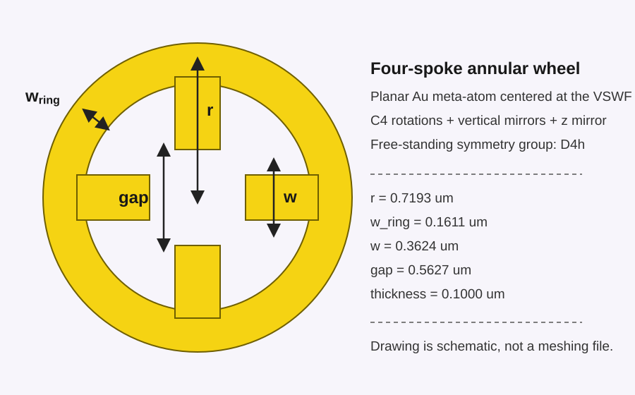
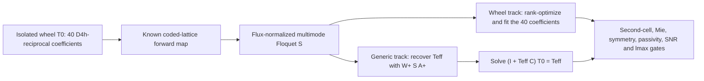

# Fast Full T-Matrix Retrieval for a Four-Spoke Annular Wheel

## Rank-optimized multimode Floquet scattering with analytic lattice de-embedding

**Status:** research proposal and feasibility plan, not yet a validated retrieval

**Target:** the free-standing four-spoke annular Au meta-atom used in this repository

**Primary output:** a complete truncated `lmax = 3` T-matrix, stored as a standards-complete `tmat.h5`

## Abstract

This proposal investigates a fast route to the complete truncated electromagnetic T-matrix of a free-standing four-spoke annular Au meta-atom. The existing one-pitch, specular-only Floquet campaign predicts periodic reflection and transmission but is too ill-conditioned to identify the underlying T-matrix. The wheel's D4h symmetry and reciprocity reduce the physical model to 40 independent complex coefficients per frequency, while a deliberately lower-symmetry measurement environment can mix otherwise dark multipole sectors. Two acquisition tracks are compared: a wheel-specific, D4h-constrained design that minimizes the number of Floquet channels, and a stronger generic algebraic design whose incoming and outgoing transforms each span all 30 `lmax = 3` VSWFs. The latter permits direct pseudoinversion and algebraic lattice de-embedding but may require a very large diffractive cell. The proposal is therefore a one-frequency feasibility hypothesis—not yet a demonstrated fast method—and defines flux-normalized rank/SNR, CST runtime, modal convention, Mie-sphere, lattice-sum, independent-cell, passivity, symmetry, and truncation gates before any broadband claim.

## 1. Decision and central idea

The conventional isolated-particle route—many incident plane waves followed by near-field or far-field projection onto vector spherical wave functions (VSWFs)—is reliable but already established. It should be retained as a benchmark, not presented as the methodological contribution.

The proposed method keeps ordinary CST Floquet-port simulations but changes what is measured. Instead of collecting only the specular TE/TM reflection and transmission at many incidence angles, one deliberately diffractive, symmetry-broken periodic environment is designed to return a complete multimode Floquet scattering matrix. Multiple diffraction orders then provide many plane-wave illumination and observation directions within the same CST project and mesh factorization.

The structure-specific proposal is:

1. Keep the four-spoke wheel unchanged.
2. Place it in a rectangular or oblique periodic cell whose symmetry is lower than D4h.
3. Use a generic nonzero Bloch vector, away from all mirror lines.
4. Retain the smallest set of non-collinear Floquet channels whose **noise-whitened wheel-specific inverse operator** is full rank.
5. Export the complete modal S-matrix rather than eight selected specular channels.
6. Recover all 40 D4h + reciprocity coefficients without a reference-derived bright mask.
7. In parallel, test a generic rank-30 algebraic inversion as a stronger but potentially slower reference design.

For the generic algebraic track, eight diffraction vectors give nominally

\[
8\ \text{vectors}\times 2\ \text{polarizations}\times 2\ \text{hemispheres}
=32
\]

incoming and outgoing channels. This is just above the 30 channels required to span the complete `lmax = 3` VSWF basis.

This is a **sufficient construction, not a minimum for this wheel**. At \(\lambda=20\) um, opening roughly eight reciprocal vectors requires a characteristic cell area of order

\[
A_\mathrm{cell}\sim\frac{8\lambda^2}{\pi}\approx 10^3\ \mathrm{um}^2,
\]

compared with the current 4 um2 cell. Such a cell has many more degrees of freedom and right-hand sides, while its sheet-scattering amplitudes scale approximately as \(1/A_\mathrm{cell}\). It may therefore be slower and lower-SNR despite excellent angular conditioning. The wheel-specific track instead asks whether a much smaller 8--12-channel data set, possibly pooled over two or three generic Bloch/cell encodings, yields a full-rank and usable 40-complex-parameter inverse.

The novelty is not merely "using diffraction orders" or applying a pseudoinverse. The defensible contribution, if the gates below are passed, is the **inverse design and CST calibration of a rank-optimized, flux-normalized multimode Floquet experiment; stable removal of lattice dressing; and cell-independent recovery with quantified error and measured computational savings**.

This proposal does **not** require a dense grid of near-field or volume monitors. It requires the complete complex Floquet-port S-matrix, the port-mode field vectors and power normalization, and one exactly matched empty-cell calculation. One CST project still contains several modal right-hand-side solves; “one project” must not be confused with “one excitation.”

## 2. Target structure

The CST builder defines the object as one Au annulus united with four rectangular inward spokes. The exact implementation is in `src/tmatrix/retrieval/cst_campaign.py:121-281` and `src/tmatrix/aggregation/cst_direct/build_saw_unitcell.py:43-140`.

| Symbol | Value | Meaning |
|---|---:|---|
| \(r\) | 0.7193 um | Outer radius |
| \(w_\mathrm{ring}\) | 0.1611 um | Radial width of the annulus |
| \(r_\mathrm{in}=r-w_\mathrm{ring}\) | 0.5582 um | Inner radius |
| \(w\) | 0.3624 um | Tangential width of each inward spoke |
| \(g\) | 0.5627 um | Tip-to-tip central gap between opposite spokes |
| \(t\) | 0.1000 um | Metal thickness |
| \(\sigma_\mathrm{Au}\) | \(4.561\times10^7\) S/m | Conductivity used in CST |

The VSWF origin must remain at the geometrical center of the ring and at the mid-plane of the metal. A displaced origin changes every off-diagonal T-matrix element by a translation transform and would invalidate comparisons.

### 2.1 Symmetry

For the free-standing object in a homogeneous background, with uniform material through the thickness, the ideal symmetry group is D4h:

- fourfold rotations about \(z\);
- vertical mirrors through the spokes and diagonals;
- a horizontal mirror through \(z=0\);
- inversion and the remaining products generated by these operations.

Reciprocity also applies to the scalar, unbiased Au model.

These assumptions cease to be exact if a substrate, unequal superstrate, ground plane, asymmetric coating, geometric offset, or magneto-optic bias is introduced. In that case the retrieval basis must be rebuilt for the actual symmetry; D4h must not be imposed merely because the top-view drawing looks symmetric.

## 3. What "full T-matrix" means here

With electric and magnetic VSWFs retained through \(\ell_{\max}=3\), the number of modes is

\[
N=2\sum_{\ell=1}^{3}(2\ell+1)=30.
\]

The desired file therefore contains a complete \(30\times30\) complex matrix at every frequency. "Complete" means that every row and column in this truncated basis is present, including weak and symmetry-forced entries; it does not mean the mathematically infinite T operator.

The distinction between stored entries and independent unknowns is important:

| Model assumption | Independent complex degrees of freedom per frequency |
|---|---:|
| Generic \(30\times30\) matrix | 900 |
| Reciprocal generic matrix | 465 |
| C4v + reciprocity | 68 |
| D4h + reciprocity for this wheel | 40 |

The final artifact is still \(30\times30\). D4h and reciprocity relate entries and force others to zero, reducing the independent information needed for denoising and validation.

Two different identifiability gates must not be confused:

- **Wheel-specific track:** write \(T_0=\sum_{\alpha=1}^{40}c_\alpha B_\alpha^{D_{4h}}\) and require the noise-whitened Jacobian of all measured modal S entries with respect to \(c\) to have complex rank 40 with useful singular-direction SNR.
- **Generic algebraic track:** require `rank(A) = rank(W) = 30`, recover an unrestricted dressed \(30\times30\) operator, and use D4h only after lattice de-embedding.

The second gate is stronger and reusable for less symmetric objects, but it is not necessary for producing the full D4h-consistent T-matrix of this particular wheel.

### 3.1 Wheel-specific symmetry sectors

The 30 VSWFs decompose under D4h into the following horizontal-parity and C4v sectors:

| Horizontal parity | \(A_1\) | \(A_2\) | \(B_1\) | \(B_2\) | \(E\) |
|---|---:|---:|---:|---:|---:|
| even (+) | 1 | 2 | 2 | 2 | 4 |
| odd (-) | 2 | 1 | 2 | 2 | 4 |

Reciprocity leaves \(\sum_s n_s(n_s+1)/2=40\) complex coefficients. The reference file suggests the strongest physical families are the even in-plane electric sector, including \(E_{1,\pm1}\) with higher-order coupling; the even axial magnetic sector containing \(M_{1,0}\); the odd axial electric sector containing \(E_{1,0}\); and weaker in-plane magnetic/electric-quadrupole and \(m=\pm2\) quadrupole sectors. These empirical amplitudes are useful for interpreting errors, but they must not be used to remove weak symmetry-allowed coefficients from a full-T retrieval.

Both physical sides remain valuable even though horizontal mirror symmetry relates them: even/odd combinations separate horizontal-parity sectors, while a generic azimuth avoids the exact cross-polarization zeros on the wheel's vertical mirror planes.

## 4. Why the existing specular retrieval fails

The present CST project retains only two modes per physical Floquet port (`src/tmatrix/retrieval/cst_campaign.py:310-324`) and the checkpoint exporter reads only eight selected S-tree entries (`src/tmatrix/retrieval/cst_solve.py:624-634`). Repeating this measurement at different specular angles produces many scalar values, but the values probe nearly the same bright combinations of the T-matrix.

For the wheel-specific D4h + reciprocity basis, the current 13-angle measurement is formally full local rank only at extremely small numerical thresholds. Its real-parameter Jacobian has a condition number of order \(10^9\), and several symmetry-allowed directions remain below the measured discrepancy scale.

A read-only noise-free diagnostic using the current forward model gave the characteristic failure:

- the nonlinear fit matched periodic S to a squared objective of approximately \(10^{-9}\);
- the recovered T nevertheless had approximately 95--108% relative Frobenius error at the two checked frequencies;
- the zero/Born seed did not reach the physical basin.

Thus excellent specular S closure is not evidence of T recovery. Adding more nearby angles at the same pitch does not address the weak singular directions or the nonlinear basin problem.

An aligned square lattice is especially unfavorable for this wheel: the lattice preserves many of the same C4v operations as the object. It changes resonance strengths but does not provide the symmetry breaking needed to mix dark irreducible sectors into independently measurable channels.

## 5. Multimode Floquet formulation

At fixed frequency and Bloch vector, every Floquet channel has in-plane wavevector

\[
\mathbf q_g=\mathbf k_B+\mathbf G_g,
\]

where \(\mathbf G_g\) is a reciprocal-lattice vector. A propagating channel satisfies \(|\mathbf q_g|<k\) and has two transverse polarizations.

All amplitudes below must be expressed in one explicitly documented **flux-normalized** convention. CST's Floquet ports are power normalized, whereas the repository's `plane_wave_coeffs` uses unit electric-field amplitude. Consequently the transforms must include the order-dependent \(\sqrt{|k_z|}\) factors, wave impedance, unit-cell area, propagation direction, and port reference-plane phase. Angular vectors alone are not the physical measurement operator.

Let

- \(A\in\mathbb C^{30\times M_\mathrm{in}}\) contain the regular-VSWF coefficients of all incident Floquet modes;
- \(W\in\mathbb C^{M_\mathrm{out}\times30}\) project outgoing VSWFs onto the outgoing Floquet modes, including the correct cell-area, \(k_z\), polarization, and CST power-normalization factors;
- \(S_\mathrm{sca}\) be the de-embedded structured-cell modal S-matrix after subtracting the matched empty-cell/direct-propagation response;
- \(C\in\mathbb C^{30\times30}\) be the lattice coupling matrix for the same cell and Bloch vector;
- \(T_0\) be the isolated-wheel T-matrix;
- \(T_\mathrm{eff}\) be the lattice-dressed T-matrix.

Then

\[
S_\mathrm{sca}=W T_\mathrm{eff} A,
\qquad
T_\mathrm{eff}=(I-T_0C)^{-1}T_0
=T_0(I-CT_0)^{-1}.
\]

If

\[
\operatorname{rank}(A)=\operatorname{rank}(W)=30,
\]

the dressed matrix is obtained without nonlinear optimization:

\[
T_\mathrm{eff}=W^+S_\mathrm{sca}A^+.
\]

The isolated matrix is recovered without explicitly inverting either T-matrix:

\[
(I+T_\mathrm{eff}C)T_0=T_\mathrm{eff},
\qquad
T_0=\operatorname{solve}(I+T_\mathrm{eff}C,T_\mathrm{eff}).
\]

The inverse formula involving \(T_\mathrm{eff}^{-1}\) should not be used in code because exact symmetry can make \(T_\mathrm{eff}\) singular. The singular values of \(I+T_\mathrm{eff}C\) must be published because this solve amplifies error near collective or Rayleigh resonances.

### 5.1 Why the rectangular environment helps

The isolated wheel remains D4h, but the dressed response generally is not. A rectangular/oblique lattice and generic \(\mathbf k_B\) deliberately mix the wheel's multipole sectors through \(C\). The measured \(T_\mathrm{eff}\) therefore must **not** be projected onto D4h before de-embedding. D4h is imposed or checked only after recovering \(T_0\).

This separation is central:

- object symmetry constrains \(T_0\);
- measurement-environment asymmetry improves observability through \(C\);
- incorrectly constraining \(T_\mathrm{eff}\) to D4h would erase the useful encoding.

### 5.2 Wheel-specific constrained track

For the faster structure-specific track,

\[
T_0(c)=\sum_{\alpha=1}^{40}c_\alpha B_\alpha^{D_{4h}},
\]

and each coded cell \(j\) predicts

\[
S_j(c)=S_{\mathrm{empty},j}
+W_j(I-T_0(c)C_j)^{-1}T_0(c)A_j.
\]

This map is nonlinear when lattice coupling is retained. Its local complex Jacobian is

\[
H_j(c)=\frac{\partial\operatorname{vec}S_j}{\partial c},
\qquad
H=\begin{bmatrix}H_1\\H_2\\\cdots\end{bmatrix}.
\]

The structure-specific identifiability gate is `rank(H) = 40` together with acceptable noise-whitened singular values—not `rank(A) = rank(W) = 30`. A weak-coupling linear solution with \(C=0\) can provide a blind seed, followed by continuation in \(C\rightarrow\eta C\), \(0\le\eta\le1\), and then a joint physical fit. This keeps all 40 coefficients and is fundamentally different from the current reference-derived bright mask.

## 6. Preliminary angular-rank result and its limitation

A current-turn kinematic search used the repository's exact 30-mode VSWF convention and examined rectangular reciprocal grids at the longest target wavelength, \(\lambda=20\) um. It evaluated the singular values of the analytic plane-wave/VSWF transforms before any CST run.

One preliminary seed design was

\[
p_x=26.0\ \mathrm{um},\qquad p_y=33.8\ \mathrm{um},
\]

with fractional Bloch shift

\[
\mathbf k_B=0.090\,\mathbf b_1-0.460\,\mathbf b_2.
\]

At 20 um this gives eight retained reciprocal vectors, 32 total channels across both ports and polarizations, numerical rank 30 for both **unit-field angular transforms**, and

\[
\kappa(A)\approx\kappa(W)\approx4.5.
\]

This result establishes only the generic track's angular-basis feasibility. The cell area is 878.8 um2—more than 200 times the current 4 um2 cell—and the reference wheel is weak at this wavelength: \(\max|T|=0.00431\), compared with 0.0781 at 8 um. A large cell also reduces periodic-sheet S amplitudes approximately as \(1/A_\mathrm{cell}\). Therefore the condition number 4.5 is **not** evidence of usable T information, accuracy, or speed.

The preliminary calculation does not yet include:

- CST's exact modal field normalization and ordering;
- empty-cell subtraction;
- the rectangular-lattice Ewald sum;
- mesh and port-reference errors;
- Wood-anomaly sensitivity;
- T-matrix truncation error;
- the conditioning of \(I+T_\mathrm{eff}C\);
- flux normalization or noise whitening;
- the expected SNR of every T singular direction;
- the CST degrees of freedom, memory, or 32-right-hand-side runtime.

The dimensions above are therefore a correctness-anchor candidate for the generic algebraic track, not frozen CST settings and not the preferred fast wheel design.

## 7. Rank-optimized cell design

The cell should be chosen by an explicit numerical design problem, not by visual intuition.

### 7.1 Candidate variables

\[
x=(p_x,p_y,\alpha_\mathrm{lat},k_{Bx},k_{By},\mathcal G),
\]

where \(\alpha_\mathrm{lat}\) is the lattice orientation relative to the spoke axes and \(\mathcal G\) is the retained reciprocal-vector set.

### 7.2 Hard constraints

- wheel track: noise-whitened `rank(H) = 40` at every extraction frequency and across a passive D4h ensemble, not only at the reference T;
- generic track: `rank(A) = rank(W) = 30` after flux normalization;
- all selected modes are propagating for the first implementation;
- avoid grazing modes, initially requiring \(|k_z|/k\ge0.2\), with a stricter value selected from the SNR study;
- remain a fixed margin away from every Rayleigh/Wood threshold;
- no overlap between periodic copies;
- the retained mode set and CST mode labels can be tracked continuously with frequency;
- every propagating order is included in the CST port model, even if only a subset is used in the inverse;
- enough evanescent modes are retained for port convergence but are not used as excitations in version 1;
- the periodic lattice sum is converged independently with an Ewald implementation;
- predicted useful-direction SNR exceeds a predeclared threshold after the measured complex-S covariance is applied;
- a CST cost proxy penalizes cell area, mesh size, number of retained port modes, and number of excited right-hand sides.

### 7.3 Objective

For the generic track, use an E-optimal or minimax angular objective such as

\[
\max_x\min_f\left\{
\sigma_{30}(A_f),\ \sigma_{30}(W_f),\
\sigma_{30}(A_f)/\sigma_1(A_f),\
\sigma_{30}(W_f)/\sigma_1(W_f)
\right\},
\]

For the wheel-specific track, the actual objective is the smallest singular value of the **flux-normalized, noise-whitened end-to-end Jacobian**:

\[
\max_x\min_{f,c\in\mathcal E}
\sigma_{40}\!\left(\Sigma_S^{-1/2}H_f(c;x)D_c\right),
\]

where \(\mathcal E\) is a target-independent passive D4h ensemble, \(\Sigma_S\) is the complex-S error covariance, and \(D_c\) supplies declared physical coefficient scales. Both objectives receive penalties for grazing channels, Wood anomalies, excessive cell area, excessive mode count, low scattered signal, and ill-conditioned lattice de-embedding.

The search should be target-independent: it may use the known VSWF basis and geometry scale, but it must not use the reference wheel T to choose bright entries or priors. The reference T is reserved for benchmarking the resulting design.

## 8. Minimal one-frequency feasibility ladder

The first extraction frequency should be near the strongest response, initially \(\lambda\approx8\) um, not 20 um. The 20 um point is retained later as the hard low-SNR test. No wheel CST run is justified until the physically normalized synthetic gate passes.

### 8.1 Stage 0: exact synthetic gate

Using the reference T only as synthetic ground truth:

- enumerate the CST-compatible propagating orders and port normalizations;
- build flux-normalized \(A\), \(W\), and Ewald \(C\);
- inject the measured complex-S discrepancy scale, mode-phase errors, and label perturbations;
- compare the wheel-specific and generic tracks on T error, singular-direction SNR, memory/RHS proxy, and robustness;
- require useful-direction SNR above 10 unless a different threshold is justified;
- require global or dominant-multipole-class T error below 5% in the blind synthetic recovery.

### 8.2 Stage 1: empty cell only

Run the optimized empty cell before any metal structure. Verify full-matrix direct transmission, reflection below \(10^{-4}\) where numerically reasonable, per-order phase, power closure, mode labels, mode reordering, memory, and wall time.

### 8.3 Stage 2: analytic Mie sphere

Place a sphere with an analytic diagonal T-matrix in the same coded cell. This is the decisive normalization and lattice-de-embedding test. Recover the supported diagonal modes to approximately 1% and the symmetry zeros to the predicted numerical floor before proceeding.

### 8.4 Stage 3: wheel and matching empty cell

Create the Au wheel and matching empty projects with identical cell, boundaries, port planes, vacuum body, Bloch vector, modal count, and solver settings. Recover the full D4h-consistent \(30\times30\) T and then repeat with a materially different second cell or Bloch encoding.

### 8.5 Floquet configuration

- wheel track: use the smallest rank-40/SNR-qualified channel set, potentially 8--12 total side/polarization channels pooled across two or three encodings;
- generic track: approximately eight or more reciprocal vectors and at least 30 independent channels on both transforms;
- both Zmin and Zmax stimulations;
- complete modal S blocks for every modeled channel, not a selected eight-entry export;
- direct single-frequency solve for the pilot;
- no adaptive broadband interpolation in the first test.

The current generator already uses `.Stimulation "All", "All"`; the main changes are the rectangular cell definition, increased Floquet-mode count, full result-tree export, and modal metadata export.

### 8.6 Required metadata

For every port mode, save:

- physical port and CST mode number;
- reciprocal indices \((g_1,g_2)\);
- \((k_x,k_y,k_z)\);
- propagation/evanescence flag;
- TE/TM field vectors at the reference plane;
- CST normalization or modal power;
- reference-plane position and phase shift;
- frequency and unit-cell area.

The empty cell alone cannot determine all polarization signs when degenerate modes are present. Port-mode field vectors are the authoritative basis calibration.

## 9. Retrieval algorithm

### 9.1 Common calibration and preprocessing

For each frequency and coded cell:

1. Read every structured-cell and empty-cell modal S block, including both physical ports and all modeled Floquet modes.
2. Identify a channel by `(side, nx, ny, TE/TM)` plus its complex port-field overlap. Never assume that a CST result-tree mode number is stable across projects or frequencies.
3. Put the structured and empty data in the same direction, polarization, phase-gauge, and power convention. Include the cell-area, impedance, and \(\sqrt{|k_z|}\) factors needed to map CST power waves to the repository's VSWF convention.
4. Translate both S-matrices to the wheel mid-plane with the signed \(k_z\) of each mode, then subtract the complete matched empty/direct operator to obtain \(S_\mathrm{sca}\).
5. Estimate a complex-S covariance \(\Sigma_S\) from mesh, port, reference-plane, and repeatability studies; do not treat all modal entries as equally accurate.
6. Construct the physical \(A\) and \(W\) matrices from the calibrated wavevectors and port fields.
7. Construct the rectangular/oblique lattice coupling \(C\) with a converged Ewald method and verify it independently.

### 9.2 Branch W: fast wheel-specific recovery

1. Build the exact 40-element D4h + reciprocity basis \(B_\alpha^{D_{4h}}\), without a reference-derived amplitude mask.
2. Obtain a blind linear seed from the \(C=0\) model.
3. Continue the lattice interaction as \(C\rightarrow\eta C\), from \(\eta=0\) to 1, minimizing the noise-whitened residual over all 40 coefficients at each step.
4. Use one qualified encoding for recovery and reserve a different cell/Bloch encoding as the strongest holdout. If two encodings are required for rank, fit both and reserve a third encoding or unused Bloch point as the holdout.
5. Publish the singular spectrum of \(\Sigma_S^{-1/2}H D_c\), parameter covariance, multistart agreement, and residual by modal block.

This branch is nonlinear because the lattice dresses the particle, but it has only 40 complex unknowns. It is the route most likely to satisfy the user's speed goal.

### 9.3 Branch G: generic algebraic recovery

If the calibrated transforms both span all 30 VSWFs:

1. compute a noise-aware generalized inverse of \(W\) and \(A\);
2. recover \(T_\mathrm{eff}=W^+S_\mathrm{sca}A^+\);
3. recover the isolated matrix with the stable linear solve

\[
(I+T_\mathrm{eff}C)T_0=T_\mathrm{eff};
\]

4. propagate the measured S uncertainty through both operations and publish \(\sigma_{\min}(I+T_\mathrm{eff}C)\).

This branch is non-iterative after calibration, applies to less-symmetric objects, and is an important correctness reference. It is not automatically fast: its large cell and approximately 30 or more modal excitations may dominate CST cost.

### 9.4 Common output

Evaluate D4h, reciprocity, passivity, origin, truncation, cell-independence, and held-out-S diagnostics. At generic Bloch wavevector, reciprocity relates the properly mapped data at \(+\mathbf k_B\) and \(-\mathbf k_B\); it does not generally imply that the S-matrix at one \(\mathbf k_B\) is simply symmetric. Save both the raw retrieved T and any uncertainty-weighted D4h + reciprocity projection. Write a self-contained `tmat.h5` with the modal convention, frequencies, geometry/material metadata, solver settings, channel maps, lattice parameters, covariance, and complete provenance.

No amplitude threshold derived from the reference T is permitted in the production retrieval.

## 10. Validation and acceptance gates

The proposal succeeds only if T—not merely S—is validated.

### Gate A: end-to-end synthetic identifiability and SNR

- wheel branch: the noise-whitened complex Jacobian has rank 40 over a declared passive D4h test ensemble, and every retained singular direction has usable SNR;
- generic branch: `rank(A) = rank(W) = 30` after physical flux normalization, with preferred \(\kappa(A),\kappa(W)\le10\) and investigation of anything above 30;
- blind synthetic T recovery remains stable under the measured complex noise, channel-phase errors, small label/field-overlap perturbations, and harmless permutations;
- global or dominant-multipole-class T error is below 5%, with useful-direction SNR initially above 10;
- the predicted cell degrees of freedom, number of right-hand sides, memory, and wall time leave a credible path to beating the conventional benchmark.

### Gate B: empty-cell and modal conventions

- all propagating orders and enough evanescent port modes are included for convergence;
- after the explicit channel permutation is applied, the complete empty-cell transmission block is diagonal and agrees with analytic propagation in amplitude and phase;
- empty reflection and cross-order leakage are below \(10^{-4}\), unless a stricter converged numerical floor is demonstrated;
- incident and outgoing modal powers close in the CST convention;
- the same channel map is obtained from port-mode fields without using the reference T;
- changing the reference plane and de-embedding back leaves the calibrated data unchanged;
- the mapped \(+\mathbf k_B\) and \(-\mathbf k_B\) empty-cell results obey reciprocity.

### Gate C: analytic Mie-sphere recovery

- in the same coded cell and conventions, recover the supported diagonal coefficients of a known Mie sphere to approximately 1%;
- recover analytically zero off-diagonal coefficients to the numerical uncertainty floor;
- obtain the same isolated sphere T from a second cell within uncertainty.

Failure here is a normalization, convention, truncation, or lattice-de-embedding failure—not a property of the wheel.

### Gate D: lattice sum and de-embedding

- rectangular-lattice \(C\) agrees between two independent implementations, preferably the repository implementation and an Ewald/treams calculation;
- \(C\) converges with summation parameters;
- publish \(\sigma_{\min}(I+T_\mathrm{eff}C)\) and the resulting error-amplification bound at every retained frequency;
- exclude encodings for which the de-embedding system is too close to singular;
- reconstruct the forward periodic S response from the recovered isolated T before examining the wheel reference T.

### Gate E: known-wheel and independent-cell benchmark

Use the existing independently supplied wheel `tmat.h5` only as ground truth:

- report global Frobenius error and per-multipole-block error;
- use absolute/global-scale tolerances for weak entries rather than meaningless relative errors near zero;
- recover from one coded cell and predict a materially different second cell/Bloch encoding; then reverse their roles;
- reconstruct periodic S for angles, pitches, and polarizations not used in the extraction;
- require reciprocity, D4h, and passivity after accounting for numerical tolerance.

Initial targets should be:

- dominant-block T error below 1--2%;
- global Frobenius error below 5% for the one-frequency pilot;
- held-out complex S error below the independently measured CST/model discrepancy;
- `max SV(I + 2T) <= 1 + 1e-3` under the repository convention;
- D4h and reciprocity residuals at or below the extraction uncertainty.

These thresholds should be tightened only after a structured mesh, solver, and modal-normalization convergence study.

The speed claim has a separate acceptance gate: report mesh factorization time, number and time of modal right-hand sides, peak memory, project size, and total structured-plus-empty wall time against the conventional isolated-particle extraction at matched accuracy. One project is not counted as one solve.

### Gate F: truncation

The 30-mode result is not physically complete unless increasing the basis does not materially change observables. Compare `lmax = 3` and `lmax = 5`:

- if the held-out S response changes by less than the target tolerance, `lmax = 3` is adequate;
- otherwise the target becomes a \(70\times70\) matrix, requiring at least 70 independent incoming and outgoing channels or a justified symmetry-constrained formulation.

## 11. Broadband strategy

A single fixed diffractive cell is unlikely to be optimal from 8 to 20 um. A cell that provides eight orders at 20 um may provide dozens at 8 um, increasing CST cost; retaining only its lowest orders may cluster directions near normal and degrade the high-order spherical-wave conditioning.

The recommended broadband strategy is therefore:

1. prove the method at one frequency;
2. divide the wavelength band into three or four overlapping subbands;
3. scale and optimize the coding lattice independently in each subband, selecting channel count from the end-to-end rank, SNR, and CST-cost objective rather than fixing it in advance;
4. recover the same isolated T on overlap frequencies and require cross-cell agreement;
5. only after raw retrieval passes, apply causal rational/vector fitting for compression and denoising.

Frequency smoothness must not be used to invent directions that remain unobservable. It is a stabilizer after spatial/modal rank has been established.

## 12. Main technical risks and stop rules

| Risk | Consequence | Required response |
|---|---|---|
| Wheel Jacobian is formally rank 40 but has weak noise-whitened directions | The optimizer can fit S while T remains wrong | Redesign or combine encodings; stop if singular-direction SNR remains inadequate |
| Actual CST modal basis gives rank below 30 | Full generic T is not determined | Redesign the reciprocal-vector set or combine two optimized cells |
| High \(\kappa(A)\) or \(\kappa(W)\) | Noise amplification in the generic branch | Change lattice/Bloch shift; do not rely on stronger regularization alone |
| Large diffractive cell suppresses sheet signal and inflates the mesh | Good angular rank is slower and lower-SNR than the baseline | Include cell area and flux-normalized signal in the design objective; reject the generic branch if it loses the cost/SNR comparison |
| A CST project requires many modal right-hand sides | “One project” gives no actual speedup | Benchmark factorization and every RHS; report total structured-plus-empty wall time |
| Mode order changes with frequency | Incorrect channel matching | Match by fields and reciprocal indices, then split the band if necessary |
| Selected order approaches cutoff | Reference-plane and power normalization instability | Enforce a Wood/grazing exclusion margin |
| Reciprocity is imposed as \(S(\mathbf k_B)=S^T(\mathbf k_B)\) | Valid generic-Bloch information is corrupted | Compare properly mapped \(+\mathbf k_B\) and \(-\mathbf k_B\) data instead |
| Rectangular \(C\) is not converged | Lattice error is absorbed into T | Require an independent Ewald implementation before accepting T |
| \(I+T_\mathrm{eff}C\) is ill-conditioned | Lattice de-embedding amplifies error | Change the encoding cell or use a jointly constrained two-cell solve |
| D4h residual is large | Convention, geometry, or retrieval error | Diagnose before projecting; do not hide it with symmetry averaging |
| Different coding cells return different \(T_0\) | Isolated T has not been identified | Stop the full-T claim and quantify the identifiable subspace |
| `lmax = 5` changes held-out S materially | `lmax = 3` is truncated too aggressively | Increase the mode basis and redesign the channel count |

The fast route should be abandoned only after the wheel-specific and generic designs fail the calibrated rank/SNR/cost gates. Failure of arbitrary-pitch or arbitrary-angle campaigns is not sufficient evidence that the optimized multimode method is impossible. Conversely, failure of both qualified tracks means that a full, accurate T is not identifiable from Floquet-port S data within the chosen resource budget; the conventional isolated-object field-projection method then becomes necessary.

## 13. Novelty boundary

The following elements are prior art and should not be claimed independently:

- full-wave plane-wave/VSWF extraction of isolated-particle T-matrices;
- periodic-array T-matrix forward models and lattice coupling;
- explicit spherical/Floquet basis transformations, including the implementation in `treams`;
- use of propagating diffraction orders and the relationship between open-order scattering matrices and effective multipolar T-matrices;
- SVD/rank analysis of that scattering-to-transition-matrix relationship;
- dipolar polarizability retrieval from rotated periodic-array R/T;
- generic pseudoinverse recovery of a linear operator.

In particular, Ustimenko, Fernandez-Corbaton, and Rockstuhl (2026) already analyze the singular-value relationship between an effective multipolar transition matrix and the plane-wave scattering matrix through open diffraction orders. Thus `S = W T_eff A`, its rank interpretation, and pseudoinversion cannot carry the novelty claim.

The defensible paper-level claim is narrower and must remain conditional until demonstrated:

> Rank-optimized, flux-normalized multimode Floquet tomography with stable algebraic lattice de-embedding and demonstrated cell-independent recovery of a symmetry-constrained higher-order T-matrix.

To survive review, the paper must include:

1. an end-to-end identifiability and error analysis for the declared D4h basis and measurement convention—not an unproved minimum-channel theorem;
2. a target-independent, noise-whitened lattice/Bloch design objective that includes cell size and computational cost;
3. a reproducible CST port-calibration, modal-label, phase-gauge, and flux-normalization protocol;
4. independently checked Ewald lattice de-embedding, its conditioning, and uncertainty propagation;
5. cell-independent recovery and held-out periodic-S prediction;
6. validation against both an analytic Mie sphere and an independently known wheel T-matrix;
7. a matched-accuracy wall-time, memory, and storage comparison with conventional direct extraction.

A less-symmetric second object would strengthen a general-method paper, but it is not required to establish the wheel-specific result.

## 14. Implementation milestones

### M0 — Freeze and preserve the current evidence

- checkpoint the current untracked retrieval tree;
- re-export the latent both-port channels from existing projects;
- preserve the current specular failure as the baseline comparison.

### M1 — Physical rank, SNR, and cost designer; no CST

- enumerate rectangular/oblique Floquet channels;
- build flux-normalized \(A\), \(W\), and the D4h coefficient basis in the repository VSWF convention;
- build the full wheel Jacobian \(H\) and a CST mesh/RHS cost proxy;
- optimize cell, Bloch shift, rotation, and channel set first at 8 um, then test the difficult 20 um point;
- compare the wheel and generic branches using noise-whitened singular spectra, expected signal, and predicted cost.

### M2 — Ewald and blind synthetic full loop

- implement full modal `S = W T_eff A`;
- implement and independently verify rectangular/oblique Ewald \(C\);
- recover blind passive D4h test matrices and the held-out reference wheel without an oracle support mask;
- inject calibrated complex noise, mode-label/phase perturbations, and propagate uncertainty;
- close Gate A before creating a large diffractive CST project.

### M3 — Empty-cell CST calibration

- build the chosen empty coded cell at 8 um;
- export full modal S, port fields, mode indices, power, and reference-plane metadata;
- verify mode tracking, full-matrix empty propagation, flux, runtime, memory, and \(+\mathbf k_B/-\mathbf k_B\) reciprocity;
- close Gate B.

### M4 — Analytic-sphere calibration

- simulate a known Mie sphere in the same cell;
- recover its analytic diagonal T and zero pattern;
- repeat in a second cell and close Gates C--D.

### M5 — Wheel and independent encoding

- simulate the wheel and its exactly matched empty reference;
- recover the full D4h- and reciprocity-consistent \(30\times30\), `lmax = 3` T;
- predict or recover a materially different holdout encoding;
- compare against the independent reference T only after blind recovery;
- close Gate E and the matched-accuracy speed gate.

### M6 — Broadband and truncation

- introduce overlapping subband cells;
- compare `lmax = 3` and `lmax = 5`;
- apply causal rational compression only after raw extraction closes.

### M7 — Deliverable

- write standards-complete `tmat.h5` files;
- publish code, exact CST projects, modal metadata, convergence tables, and provenance;
- benchmark wall time, memory, field-storage volume, T error, and held-out S error against the conventional method.

## 15. References

1. Fruhnert et al., "Computing the T-matrix of a scattering object with multiple plane wave illuminations," *Beilstein Journal of Nanotechnology* 8, 614--626 (2017). https://doi.org/10.3762/bjnano.8.66
2. Demesy, Stout, and Auger, "Scattering matrix of arbitrarily shaped objects: combining finite elements and vector partial waves," *JOSA A* 35, 1401--1409 (2018). https://doi.org/10.1364/JOSAA.35.001401
3. Liu, Zhao, and Alu, "Polarizability Tensor Retrieval for Subwavelength Particles of Arbitrary Shape," *IEEE Transactions on Antennas and Propagation* 64, 2301--2310 (2016). https://doi.org/10.1109/TAP.2016.2546958
4. Rahimzadegan et al., "A Comprehensive Multipolar Theory for Periodic Metasurfaces," *Advanced Optical Materials* 10, 2102059 (2022). https://doi.org/10.1002/adom.202102059
5. Beutel et al., "Treams: A T-matrix scattering code for nanophotonics," *Computer Physics Communications* 297, 109076 (2024). https://doi.org/10.1016/j.cpc.2023.109076
6. Ustimenko, Fernandez-Corbaton, and Rockstuhl, "Singular value decomposition to describe bound states in the continuum in periodic metasurfaces," *Physical Review B* 113, 235418 (2026). https://arxiv.org/abs/2602.15741
7. Asadova et al., "T-matrix representation of optical scattering response: Suggestion for a data format," *Journal of Quantitative Spectroscopy and Radiative Transfer* 333, 109310 (2025). https://doi.org/10.1016/j.jqsrt.2024.109310

## 16. Bottom line

For this four-spoke annular wheel, a fast full `lmax = 3` T-matrix is **plausible but not yet demonstrated**. Here “full” means the complete stored \(30\times30\) matrix consistent with the wheel's D4h symmetry and reciprocity, not a generic 900-complex-parameter object and not the infinite-order physical operator. The current specular S campaign is poorly conditioned and nonlinear; more similar angles are unlikely to fix it.

The best chance of meeting the speed goal is the wheel-specific 40-coefficient branch using a small number of carefully designed multimode encodings. The generic rank-30 algebraic branch is cleaner mathematically but may be slower than the standard method because its large cell weakens the sheet signal and requires many modal right-hand sides.

The next justified action is therefore **M1 at 8 um**, followed by the Ewald/noisy synthetic loop—not a broadband CST campaign. Only if that end-to-end test predicts usable SNR, stable recovery, and a wall-time advantage should the empty-cell, Mie-sphere, and wheel CST ladder begin. If neither branch passes the calibrated rank/SNR/cost gates, then a fast accurate full T from Floquet S alone is not achievable under the selected resource budget, and isolated-particle field projection is the honest fallback.
